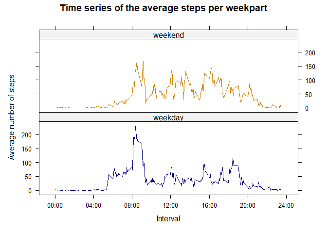

**Note of the author**: this document has been written directly in R Studio as a R Markdown file and knitted from there (and not from console).

# Introduction

It is now possible to collect a large amount of data about personal movement using activity monitoring devices such as a Fitbit, Nike Fuelband, or Jawbone Up. These type of devices are part of the “quantified self” movement – a group of enthusiasts who take measurements about themselves regularly to improve their health, to find patterns in their behavior, or because they are tech geeks. But these data remain under-utilized both because the raw data are hard to obtain and there is a lack of statistical methods and software for processing and interpreting the data.

This small project makes use of data from a personal activity monitoring device. This device collects data at 5 minute intervals through out the day. The data consists of two months of data from an anonymous individual collected during the months of October and November, 2012 and include the number of steps taken in 5 minute intervals each day.

The data for this assignment can be downloaded from the course web site:

- Dataset: [Activity monitoring data](https://d396qusza40orc.cloudfront.net/repdata%2Fdata%2Factivity.zip)

The variables included in this dataset are:

| Variable | Description |
| :---: | :------------------------------------------- |
| steps | Number of steps taking in a 5-minute interval (missing values are coded as NA)|
| date | The date on which the measurement was taken in YYYY-MM-DD format |
| interval | Identifier for the 5-minute interval in which measurement was taken. |

The dataset is stored in a comma-separated-value (CSV) file and there are a total of 17,568 observations in this dataset.

# Project

## Loading and preprocessing the data {#preprocess}

First of all, we download and unzip the data, in case the data set is not 
already available in the working directory.


```r
if (!file.exists("activity.zip")) {
        urlData <- "https://d396qusza40orc.cloudfront.net/repdata%2Fdata%2Factivity.zip";
        download.file(url = urlData, destfile = "activity.zip");
}

if (!file.exists("activity.csv")) {
        unzip("activity.zip")
}
```

Then, before loading the whole data set with `read.csv()`, we give a quick look at its heading:


```r
read.csv("activity.csv", nrows=14)
```

```
##    steps       date interval
## 1     NA 2012-10-01        0
## 2     NA 2012-10-01        5
## 3     NA 2012-10-01       10
## 4     NA 2012-10-01       15
## 5     NA 2012-10-01       20
## 6     NA 2012-10-01       25
## 7     NA 2012-10-01       30
## 8     NA 2012-10-01       35
## 9     NA 2012-10-01       40
## 10    NA 2012-10-01       45
## 11    NA 2012-10-01       50
## 12    NA 2012-10-01       55
## 13    NA 2012-10-01      100
## 14    NA 2012-10-01      105
```

We observe/confirm that :

- the columns have headings;
- the first column, "steps", comes from a counting variable, hence shall contain only integers;
- the second column, "date", shall contain the dates of the measurements in the format YYYY-MM-DD;
- the third column, "interval", shall contain the identifier for the 5-minute interval in which measurement was taken, which is an integer between 0 and 2400 of the form hhmm.

Therefore, we can specify a few arguments to make the procedure faster:


```r
rawData <- read.csv("activity.csv",
                    header = TRUE,
                    colClasses = c("numeric", "character", "numeric"))
summary(rawData)
```

```
##      steps            date              interval     
##  Min.   :  0.00   Length:17568       Min.   :   0.0  
##  1st Qu.:  0.00   Class :character   1st Qu.: 588.8  
##  Median :  0.00   Mode  :character   Median :1177.5  
##  Mean   : 37.38                      Mean   :1177.5  
##  3rd Qu.: 12.00                      3rd Qu.:1766.2  
##  Max.   :806.00                      Max.   :2355.0  
##  NA's   :2304
```

Our initial observations are confirmed by:


```r
identical(rawData$steps, as.numeric(as.integer(rawData$steps))) # TRUE
identical(rawData$interval, as.numeric(as.integer(rawData$interval))) # TRUE
```

Therefore, we can convert the columns into a more convenient format:


```r
rawData$steps <- as.integer(rawData$steps)
rawData$date <- as.Date(rawData$date, format = "%Y-%m-%d")
rawData$interval <- as.integer(rawData$interval)
```

Recall that the summary tells that we have 2304 NA under the "steps" variable.  That is to say:  


```r
sum(is.na(rawData$steps))/nrow(rawData)
```

```
## [1] 0.1311475
```

around 13% of the total observations.

A second look at the data leads to conjecture that NAs are concentrated in days without observations. Let us check:


```r
byDay <- aggregate(steps ~ date, 
                   data = rawData, 
                   FUN = function(X) { sum(is.na(X)) }, 
                   na.action = na.pass)
names(byDay) <- c("date","NAs")
byDay[byDay$NAs != 0,]
```

```
##          date NAs
## 1  2012-10-01 288
## 8  2012-10-08 288
## 32 2012-11-01 288
## 35 2012-11-04 288
## 40 2012-11-09 288
## 41 2012-11-10 288
## 45 2012-11-14 288
## 61 2012-11-30 288
```

The conjecture was true. Moreover, we conclude that there are 8 days without observations:


```r
sum(byDay$NAs != 0)
```

```
## [1] 8
```


For the moment, we ignore them and we promote "rawData" to our tidy "data" set:


```r
data <- rawData
```

Now, we are ready to begin our analysis.

## What is mean total number of steps taken per day?

We start by calculating the total number of steps taken per day and I choose to keep track of the NAs:


```r
daySteps <- aggregate(steps ~ date, 
                      data = data, 
                      sum, 
                      na.action = na.pass)
```

Then, we plot an histogram of the result:


```r
# the ylim parameter is settled in order to make the histogram easily comparable with the one after imputing
hist(daySteps$steps,
     main = "Total number of steps per day",
     xlab = "Number of steps",
     ylim = c(0,40),
     col = "Steelblue")
```

<!-- -->

from which we can already guess that the mean and median of the total number of steps are going to lay between 10000 and 15000. The result is confirmed by:


```r
mean(daySteps$steps, na.rm = TRUE)
```

```
## [1] 10766.19
```

```r
median(daySteps$steps, na.rm = TRUE)
```

```
## [1] 10765
```

## What is the average daily activity pattern?

In order to analyse the average daily activity pattern, we first compute the average number of steps per 5-minute interval, this time omitting the NAs:


```r
intervalSteps <- aggregate(steps ~ interval, 
                           data = data, 
                           mean, 
                           na.action = na.omit)
```

and we make a time series plot of the result:


```r
with(intervalSteps,
     plot(interval, steps,
          type = "l",
          col = "navyblue",
          xlab = "",
          ylab = "",
          xaxt = "n"))
axis(side = 1,
     at = seq(0,2400,length.out = 7),
     labels = c("00:00", "04:00", "08:00", "12:00", "16:00", "20:00", "24:00"))
title(main = "Time series of the average steps per 5-minute interval",
      xlab = "Time",
      ylab = "Average number of steps")
```

<!-- -->

We immediately notice that there is a peak in the activity around 8am. To find the exact interval, we introduce a function to convert the identifier of the interval into a human readable time


```r
int_to_time <- function(X) {
        # takes an integer hhmm between 0 and 2400 and converts it into "hh:mm"
        hh <- as.integer(X/100)
        mm <- X-as.integer(X/100)*100
        if (mm %in% 0:9) {
                return(paste(hh,":0", mm, sep = ""));
        }
        else if (mm %in% 10:59) {
                return(paste(hh,":", mm, sep = ""));
        }
        else print("Input is not an integer between 0 and 2400")
}
```

then we compute the index of the maximum and so the interval of time:


```r
i_max <- which.max(intervalSteps$steps)
cat(int_to_time(intervalSteps$interval[i_max]),
    "-",
    int_to_time(intervalSteps$interval[i_max+1]),
    sep = " ")
```

```
## 8:35 - 8:40
```

## Imputing missing values

Now it is time to deal with the missing values. There are


```r
sum(is.na(data$steps))
```

```
## [1] 2304
```

missing values, distributed as we observed in [the first section](#preprocess). In view of what we observed there, to fill in the NAs I can impute the missing data by using the average of the ones from the same interval in the other days, taking advantage fo the fact that R recycles vectors: each chunk of missing data consists of 288 missing measurements, that I can fill in with the 288 means in "intervalSteps".
Even if this breaks the coherence, I do not truncate the average to obtain an integer.


```r
imputed_data <- data
imputed_data[is.na(data$steps),"steps"] <- intervalSteps$steps
```

To see the impact of imputing missing data on our estimates, let us plot the histogram of the total number of steps per day again:


```r
# this time I decide to use dplyr, for the sake of elegance
library(dplyr)

imputed_daySteps <- imputed_data %>%
        as_tibble %>%
        group_by(date) %>%
        summarise(steps = sum(steps))

hist(imputed_daySteps$steps,
     main = "Total number of steps per day\nafter imputing",
     xlab = "Number of steps",
     ylim = c(0,40),
     col = "Steelblue")
```

<!-- -->

and we may compare it with our first histogram: the peak is 8 points higher. As we expect, the mean does not change (this can be checked directly with a few algebraic manipulations) while the median does and becomes equal to the mean.


```r
# the mean does not change (this is math), while the median does
mean(imputed_daySteps$steps)
```

```
## [1] 10766.19
```

```r
median(imputed_daySteps$steps)
```

```
## [1] 10766.19
```

## Are there differences in activity patterns between weekdays and weekends?

Let us add a factor variable "weekpart" to our imputed data set, to keep track of whether the data come from a weekday or not:


```r
weekend <- c("Saturday", "Sunday")
imputed_data$weekpart <- as.factor(
        if_else(weekdays(imputed_data$date) %in% weekend,
                "weekend",
                "weekday")
        )
```

Then, let us plot again the time series, but now separated between weekdays and weekends.


```r
# for the sake of elegance, I will use the lattice package
library(lattice)
library(dplyr)

weekpartSteps <- imputed_data %>%
        group_by(weekpart,interval) %>%
        summarise(steps = mean(steps))

COLORS = c("navyblue","orange3")
xyplot(steps ~ interval | weekpart, 
       data = weekpartSteps, 
       type = "l", 
       layout = c(1,2),
       panel = function(x,y,...) {
               panel.xyplot(x, y, col = COLORS[panel.number()],...) 
               },
       main = "Time series of the average steps per weekpart",
       xlab = "Interval",
       ylab = "Average number of steps",
       scales = list(x = list(at = seq(0,2400,length.out = 7),
                              labels = c("00:00", "04:00", "08:00", "12:00", 
                                         "16:00", "20:00", "24:00")
                              )
                     )
       )
```

<!-- -->

Thus we can conclude that there is a difference in activity patterns between weekdays and weekends: weekdays begin earlier and are more sedentary than weekends.
