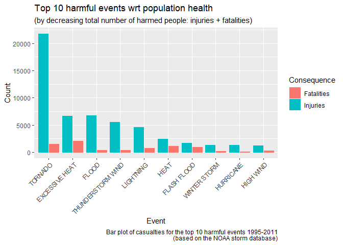
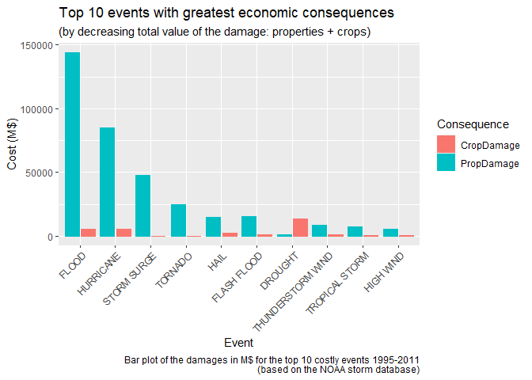
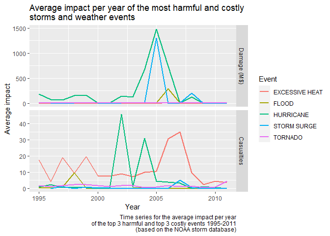

# Synopsis

Based on the NOAA Storm Events Database, we describe and compare the most harmful and costly storms and weather events in the US in the period January 1995 - November 2011. Our leading question is to determine, from historical data, which events have the greatest impact on society and economy. Our analysis leads to observe that even if tornadoes and floods are, in absolute terms, the most harmful and costly events, respectively, on average they are second to hurricanes and heat waves, respectively.

# Data Processing

## Packages

The following packages need to be installed and, possibly, loaded:


```r
autoload("bunzip2", "R.utils")
autoload("pivot_longer","tidyr")
autoload("str_replace_all","stringr")
library(lubridate)
library(dplyr)
library(ggplot2)
```

For the sake of reproducibility, seed is set to 0:


```r
set.seed(0)
```

## Loading data

From the U.S. [National Oceanic and Atmospheric Administration (NOAA)](https://www.ncei.noaa.gov/) we obtained the Storm Events Database, which comes in the form of a comma-separated-value file compressed via the bzip2 algorithm and that can be downloaded from the Coursera course web site: [Storm Event Database](https://d396qusza40orc.cloudfront.net/repdata%2Fdata%2FStormData.csv.bz2).

There is also some documentation of the database available, that can be downloaded from the course web site. Here you will find how some of the variables are constructed/defined:

- National Weather Service [Storm Data Documentation](https://d396qusza40orc.cloudfront.net/repdata%2Fpeer2_doc%2Fpd01016005curr.pdf)

- National Climatic Data Center Storm Events [FAQ](https://d396qusza40orc.cloudfront.net/repdata%2Fpeer2_doc%2FNCDC%20Storm%20Events-FAQ%20Page.pdf)

The events in the database start in the year 1950 and end in November 2011. In the earlier years of the database there are generally fewer events recorded, most likely due to a lack of good records. More recent years should be considered more complete.

First we download the database in the "data" folder:


```r
if (!dir.exists("data")) {
        dir.create("data");
}

if (!file.exists("data/StormData.csv.bz2")) {
        urlData <- paste("https://d396qusza40orc.cloudfront.net/",
                         "repdata%2Fdata%2FStormData.csv.bz2",
                         sep = "");
        download.file(url = urlData, 
                      destfile = "data/StormData.csv.bz2");
}

if (!file.exists("data/StormData.csv")) {
        bunzip2(filename = "data/StormData.csv.bz2",
                destname = "data/StormData.csv",
                skip = TRUE,
                remove = FALSE);
}
```

Then we read it into R by taking advantage of the fact that we know it will contain 902297 rows (see [this post](https://www.coursera.org/learn/reproducible-research/discussions/weeks/4/threads/38y35MMiEeiERhLphT2-QA?page=1)).


```r
rawData <- read.csv("data/StormData.csv", 
                    header = TRUE,
                    nrows = 902297)
dim(rawData)
```

```
## [1] 902297     37
```

Here is the full list of the variables at disposal.


```r
names(rawData)
```

```
##  [1] "STATE__"    "BGN_DATE"   "BGN_TIME"   "TIME_ZONE"  "COUNTY"    
##  [6] "COUNTYNAME" "STATE"      "EVTYPE"     "BGN_RANGE"  "BGN_AZI"   
## [11] "BGN_LOCATI" "END_DATE"   "END_TIME"   "COUNTY_END" "COUNTYENDN"
## [16] "END_RANGE"  "END_AZI"    "END_LOCATI" "LENGTH"     "WIDTH"     
## [21] "F"          "MAG"        "FATALITIES" "INJURIES"   "PROPDMG"   
## [26] "PROPDMGEXP" "CROPDMG"    "CROPDMGEXP" "WFO"        "STATEOFFIC"
## [31] "ZONENAMES"  "LATITUDE"   "LONGITUDE"  "LATITUDE_E" "LONGITUDE_"
## [36] "REMARKS"    "REFNUM"
```

Most variable names are self-explanatory but few are vague and difficult to find in the Strom Data Documentation or in the FAQ. The following explanation mainly comes from the same [post](https://www.coursera.org/learn/reproducible-research/discussions/weeks/4/threads/38y35MMiEeiERhLphT2-QA?page=1).

From the documentation:  

> [Damage] estimates should be rounded to three significant digits, followed by an alphabetical character signifying the magnitude of the number, i.e., 1.55B for $1,550,000,000. Alphabetical characters used to signify magnitude include “K” for thousands, “M” for millions, and “B” for billions.  

The **CROPDMGEXP** is the magnitude character for **CROPDMG** (crop damage). In the same way, **PROPDMGEXP** is the magnitude character for **PROPDMG** (property damage). B or b = Billion, M or m = Million, K or k = Thousand, H or h = Hundred. In fact, other characters appear. The numbers from 0 to 9 seem to represent units. The symbols "-", "+" and "?" seems to refer to less than, greater than and low certainty. We refer the reader to the analysis and to [How To Handle Exponent Value of PROPDMGEXP and CROPDMGEXP](https://rstudio-pubs-static.s3.amazonaws.com/58957_37b6723ee52b455990e149edde45e5b6.html), where the issue is discussed in more depth.

**WFO** = Weather Forecast Office, **F** = Fujita tornado intensity scale (F-Scale), **MAG** = Magnitude, or Strength, of the event. It is required by NOAA for Wind and Hail events if it is known. Wind Events are in KNOTS. Hail is in INCHES and TENTHS without the decimal (one and one-half are 150). **STATE__ ** = State FIPS number. **LENGTH** = Path length of a tornado (in miles and tenths of miles). **WIDTH** = Path width of a tornado, in yards.

## Processing data

In view of the questions we aim to answer, we can process the raw data in order to extract and isolate the information of interest.

First, we isolate from the whole database the variables of interest and we start constructing our final `Data` data set:


```r
Data <- rawData
Data <- Data %>%
        select(BGN_DATE, EVTYPE, FATALITIES:CROPDMGEXP, REFNUM) %>%
        filter(FATALITIES > 0 | INJURIES > 0 | PROPDMG > 0 | CROPDMG > 0)
Data$EVTYPE <- toupper(Data$EVTYPE)
```

Apart from the `EVTYPE`, `FATALITIES`, `INJURIES`, `PROPDMG`, `PROPDMGEXP`, `CROPDMG` and `CROPDMGEXP` variables, we keep track of the `BGN_DATE` in order to be able to perform an analysis year by year and of the unique identifier `REFNUM` in order to be able to recover from `rawData` the information we may loose while processing the data.

We also need to extract the information about crop and property damage. For this, we need to interpret the magnitude characters:


```r
table(Data$PROPDMGEXP)
```

```
## 
##             -      +      0      2      3      4      5      6      7      B 
##  11585      1      5    210      1      1      4     18      3      3     40 
##      h      H      K      m      M 
##      1      6 231428      7  11320
```

```r
table(Data$CROPDMGEXP)
```

```
## 
##             ?      0      B      k      K      m      M 
## 152664      6     17      7     21  99932      1   1985
```

In this, we will take advantage of the modern [Storm Events Database](https://www.ncdc.noaa.gov/stormevents/choosedates.jsp?statefips=-999%2CALL).

### Property damage

#### (-) magnitude


```r
rawData[rawData$PROPDMGEXP == "-",1:28]
```

```
##        STATE__           BGN_DATE BGN_TIME TIME_ZONE COUNTY
## 229327      41 12/12/1995 0:00:00     1000       PST      0
##                        COUNTYNAME STATE    EVTYPE BGN_RANGE BGN_AZI BGN_LOCATI
## 229327 ORZ004 - 05 - 06 - 08 - 09    OR HIGH WIND         0                   
##                  END_DATE END_TIME COUNTY_END COUNTYENDN END_RANGE END_AZI
## 229327 12/12/1995 0:00:00     2000          0         NA         0        
##        END_LOCATI LENGTH WIDTH  F MAG FATALITIES INJURIES PROPDMG PROPDMGEXP
## 229327                 0     0 NA   0          2        0      15          -
##        CROPDMG CROPDMGEXP
## 229327       0
```

Our database reports only one entry, but searching on the [Storm Events Database](https://www.ncdc.noaa.gov/stormevents/choosedates.jsp?statefips=-999%2CALL) on the same date period there is no data. Therefore, we assume it as a multiplier of 0.

#### (+) magnitude


```r
rawData[rawData$PROPDMGEXP == "+",1:28][5,]
```

```
##        STATE__         BGN_DATE BGN_TIME TIME_ZONE COUNTY         COUNTYNAME
## 216802      32 6/5/1995 0:00:00     1304       PDT      0 NVZ003 - 004 - 007
##        STATE  EVTYPE BGN_RANGE BGN_AZI      BGN_LOCATI         END_DATE
## 216802    NV TORNADO         0         Extreme Western 6/5/1995 0:00:00
##        END_TIME COUNTY_END COUNTYENDN END_RANGE END_AZI END_LOCATI LENGTH WIDTH
## 216802  1330PDT          0         NA         0                       0.5   300
##         F MAG FATALITIES INJURIES PROPDMG PROPDMGEXP CROPDMG CROPDMGEXP
## 216802 NA   0          0        0      60          +       0
```

From [Storm Events Database](https://www.ncdc.noaa.gov/stormevents/choosedates.jsp?statefips=-999%2CALL) with parameters

- Select State/Area = “Nevada”,
- Select County = “All”
- Select Begin Date = End Date = “06/05/1995”
- Select Event Type = “Tornado”

we find

| Location | County/Zone | St. | Date | Time | T.Z. | Type | Mag | Dth | Inj | PrD | CrD |
| --- | --- | --- | --- | --- | --- | --- | --- | --- | --- | --- | --- |
| Extreme Western | NVZ003 - 004 - 007 CO. | NV | 06/05/1995 | 13:04 | PDT | Tornado | | 0 | 0 | 0.06K | 0.00K |

hence we may assume that (+) is not affecting the `PROPDMG` column.

#### Numeric magnitude


```r
rawData[rawData$PROPDMG > 0 & rawData$PROPDMGEXP == "2",1:28]
```

```
##        STATE__         BGN_DATE BGN_TIME TIME_ZONE COUNTY COUNTYNAME STATE
## 212832      29 6/8/1995 0:00:00     0459       CST     27   CALLAWAY    MO
##                   EVTYPE BGN_RANGE BGN_AZI BGN_LOCATI END_DATE END_TIME
## 212832 THUNDERSTORM WIND         1      NE   Shamrock                  
##        COUNTY_END COUNTYENDN END_RANGE END_AZI END_LOCATI LENGTH WIDTH  F MAG
## 212832          0         NA         0                         0     0 NA   0
##        FATALITIES INJURIES PROPDMG PROPDMGEXP CROPDMG CROPDMGEXP
## 212832          0        0      12          2       0
```

Again, from [Storm Events Database](https://www.ncdc.noaa.gov/stormevents/choosedates.jsp?statefips=-999%2CALL) with parameters

- Select State/Area = “All”,
- Select County = “All”
- Select Begin Date = End Date = “06/08/1995”
- Select Event Type = “Thunderstorm Wind”

we find

| Location | County/Zone | St. | Date | Time | T.Z. | Type | Mag | Dth | Inj | PrD | CrD |
| --- | --- | --- | --- | --- | --- | --- | --- | --- | --- | --- | --- |
| Shamrock | CALLAWAY CO. | MO | 06/08/1995 | 04:59 | CST | Thunderstorm Wind | 0 kts. | 0 | 0 | 0.12K | 0.00K | 

This, together with the similar considerations that can be found in [How To Handle Exponent Value of PROPDMGEXP and CROPDMGEXP](https://rstudio-pubs-static.s3.amazonaws.com/58957_37b6723ee52b455990e149edde45e5b6.html), leads us to assume that a numeric magnitude entails a multiplication by 10 of the `PROPDMG` column. 

#### Empty magnitude

Similarly, we assume that an empty character implies multiplication by 0.
        
#### Extracting the property damage information

We can now introduce a new variable `PropDamage` measuring the actual value of the damage to properties.


```r
Data$PROPDMGEXP <- toupper(Data$PROPDMGEXP) 
Data$PROPDMGEXP <- str_replace_all(Data$PROPDMGEXP,
                                   c("[0-8]" = "10",
                                     "\\+" = "1",
                                     "\\-" = "0",
                                     "B" = "1000000000",
                                     "M" = "1000000",
                                     "K" = "1000",
                                     "H" = "100"))
Data[Data$PROPDMGEXP == "",]$PROPDMGEXP <- "0"
Data$PROPDMGEXP <- as.integer(Data$PROPDMGEXP)
Data$PropDamage <- Data$PROPDMG*Data$PROPDMGEXP
```

### Crops damage

#### (?) magnitude


```r
Data[Data$CROPDMGEXP == "?",c(1,6:7)]
```

```
##                BGN_DATE PROPDMGEXP CROPDMG
## 29225  3/9/1995 0:00:00          0       0
## 31241 2/12/1993 0:00:00       1000       0
## 31398 2/12/1993 0:00:00       1000       0
## 42652 2/16/1995 0:00:00       1000       0
## 46855 8/26/1995 0:00:00    1000000       0
## 51191 4/17/1995 0:00:00       1000       0
```

This makes evident that we may consider a (?) magnitude as 0. 

#### Empty magnitude

Concerning the empty magnitude, if we compare


```r
rawData[rawData$CROPDMG != 0 & rawData$CROPDMGEXP == "",1:28]
```

```
##        STATE__          BGN_DATE BGN_TIME TIME_ZONE COUNTY COUNTYNAME STATE
## 221857      38  7/4/1994 0:00:00     0400       CST     93   STUTSMAN    ND
## 238757      48  4/5/1994 0:00:00     1700       CST    209       HAYS    TX
## 240397      48 4/15/1994 0:00:00     1630       CST    325     MEDINA    TX
##                    EVTYPE BGN_RANGE BGN_AZI BGN_LOCATI END_DATE END_TIME
## 221857               HAIL         0          Jamestown                  
## 238757 THUNDERSTORM WINDS         0         San Marcos                  
## 240397 THUNDERSTORM WINDS         0         Countywide                  
##        COUNTY_END COUNTYENDN END_RANGE END_AZI END_LOCATI LENGTH WIDTH  F MAG
## 221857          0         NA         0                         0     0 NA 175
## 238757          0         NA         0                         0     0 NA  52
## 240397          0         NA         0                         0     0 NA   0
##        FATALITIES INJURIES PROPDMG PROPDMGEXP CROPDMG CROPDMGEXP
## 221857          0        0       5          K       3           
## 238757          0        0       5          M       4           
## 240397          0        0     500          K       4
```

with, for example, a search on the [Storm Events Database](https://www.ncdc.noaa.gov/stormevents/choosedates.jsp?statefips=-999%2CALL) with parameters

- Select State/Area = “Texas”,
- Select County = “Medina”
- Select Begin Date = End Date = “04/05/1994”
- Select Event Type = “All Events”

that returns

| Location | County/Zone | St. | Date | Time | T.Z. | Type | Mag | Dth | Inj | PrD | CrD |
| --- | --- | --- | --- | --- | --- | --- | --- | --- | --- | --- | --- |
| Countywide | MEDINA CO. | TX | 04/15/1994 | 16:30 | CST | Thunderstorm Wind | 0 kts. | 0 | 0 | 500.00K | 0.00K | 

we conclude that we can assume the empty magnitude to be a multiplier by 0, too.

#### Extracting the crops damage information

Therefore, we can introduce the new variable `CropDamage` as above.


```r
Data$CROPDMGEXP <- toupper(Data$CROPDMGEXP)
Data[Data$CROPDMGEXP == "?",]$CROPDMGEXP <- "0"
Data[Data$CROPDMGEXP == "",]$CROPDMGEXP <- "0"
Data$CROPDMGEXP <- str_replace_all(Data$CROPDMGEXP,
                                   c("B" = "1000000000",
                                     "M" = "1000000",
                                     "K" = "1000"))
Data$CROPDMGEXP <- as.integer(Data$CROPDMGEXP)
Data$CropDamage <- Data$CROPDMG*Data$CROPDMGEXP
```

### Years

In order to be able to perform an analysis year by year, we are also interested in extracting this information from the raw data.


```r
Data$BGN_DATE <- Data$BGN_DATE %>% 
        str_replace_all(" 0:00:00","") %>%
        mdy
Data$Year <- year(Data$BGN_DATE)
```

Moreover, this allows us to observe that before 1982 only tornadoes were recorded and from 1982 until 1992 only tornadoes, thunderstorm winds and hail were recorded. 


```r
Records <- Data %>%
        group_by(Year, EVTYPE) %>%
        summarise(EventCount = n()) %>%
        ungroup %>%
        as.data.frame
head(Records, n = 100)
```

```
##     Year                 EVTYPE EventCount
## 1   1950                TORNADO        201
## 2   1951                TORNADO        241
## 3   1952                TORNADO        233
## 4   1953                TORNADO        421
## 5   1954                TORNADO        491
## 6   1955                TORNADO        441
## 7   1956                TORNADO        428
## 8   1957                TORNADO        824
## 9   1958                TORNADO        543
## 10  1959                TORNADO        505
## 11  1960                TORNADO        556
## 12  1961                TORNADO        627
## 13  1962                TORNADO        411
## 14  1963                TORNADO        380
## 15  1964                TORNADO        594
## 16  1965                TORNADO        724
## 17  1966                TORNADO        423
## 18  1967                TORNADO        683
## 19  1968                TORNADO        524
## 20  1969                TORNADO        458
## 21  1970                TORNADO        517
## 22  1971                TORNADO        714
## 23  1972                TORNADO        579
## 24  1973                TORNADO       1026
## 25  1974                TORNADO        884
## 26  1975                TORNADO        748
## 27  1976                TORNADO        707
## 28  1977                TORNADO        693
## 29  1978                TORNADO        620
## 30  1979                TORNADO        655
## 31  1980                TORNADO        728
## 32  1981                TORNADO        578
## 33  1982                TORNADO       1128
## 34  1983                TORNADO        994
## 35  1983              TSTM WIND         25
## 36  1984                   HAIL          9
## 37  1984                TORNADO        796
## 38  1984              TSTM WIND        115
## 39  1985                   HAIL          4
## 40  1985                TORNADO        481
## 41  1985              TSTM WIND         90
## 42  1986                   HAIL         10
## 43  1986                TORNADO        558
## 44  1986              TSTM WIND        122
## 45  1987                   HAIL          9
## 46  1987                TORNADO        413
## 47  1987              TSTM WIND        141
## 48  1988                   HAIL          6
## 49  1988                TORNADO        538
## 50  1988              TSTM WIND        134
## 51  1989                   HAIL         12
## 52  1989                TORNADO        589
## 53  1989              TSTM WIND        190
## 54  1990                   HAIL          5
## 55  1990                TORNADO        792
## 56  1990              TSTM WIND        189
## 57  1991                   HAIL          5
## 58  1991                TORNADO        683
## 59  1991              TSTM WIND        191
## 60  1992                   HAIL         18
## 61  1992                TORNADO        869
## 62  1992              TSTM WIND        103
## 63  1993               AVALANCE          1
## 64  1993              AVALANCHE          1
## 65  1993               BLIZZARD         22
## 66  1993  BLIZZARD/WINTER STORM          1
## 67  1993          COASTAL FLOOD          9
## 68  1993       COASTAL FLOODING          3
## 69  1993          COASTAL SURGE          1
## 70  1993                   COLD          6
## 71  1993             COLD/WINDS          1
## 72  1993           COOL AND WET          1
## 73  1993              DENSE FOG          5
## 74  1993                DROUGHT          2
## 75  1993             DUST DEVIL          3
## 76  1993             DUST STORM          2
## 77  1993           EXTREME COLD          5
## 78  1993            FLASH FLOOD        583
## 79  1993 FLASH FLOOD LANDSLIDES          1
## 80  1993           FLASH FLOOD/          1
## 81  1993         FLASH FLOODING         10
## 82  1993           FLASH FLOODS          2
## 83  1993                  FLOOD        284
## 84  1993      FLOOD/FLASH FLOOD         81
## 85  1993       FLOOD/FLASHFLOOD          1
## 86  1993      FLOOD/RIVER FLOOD          1
## 87  1993               FLOODING          9
## 88  1993                 FLOODS          2
## 89  1993                 FREEZE          1
## 90  1993          FREEZING RAIN         15
## 91  1993                  FROST          5
## 92  1993          FROST\\FREEZE          1
## 93  1993           FUNNEL CLOUD          1
## 94  1993        GROUND BLIZZARD          1
## 95  1993            GUSTY WINDS          1
## 96  1993                   HAIL        826
## 97  1993                   HEAT          8
## 98  1993             HEAVY RAIN          6
## 99  1993            HEAVY RAINS          5
## 100 1993             HEAVY SNOW        111
```

Not taking this into account would bias our analysis.

### Preliminary version of tidy data set

Now that we have extracted the information we are interested in, we can remove the variables we do not need. Furthermore, in order to limit the bias we just observed, we consider only the years from 1995 included.


```r
Data <- Data %>%
        select(c(EVTYPE:INJURIES, PropDamage, CropDamage, Year, REFNUM)) %>%
        filter(Year >1994)

head(Data)
```

```
##                      EVTYPE FATALITIES INJURIES PropDamage CropDamage Year
## 1 HURRICANE OPAL/HIGH WINDS          2        0    1.0e+08      1e+07 1995
## 2            HURRICANE ERIN          0        0    2.5e+07      1e+06 1995
## 3        THUNDERSTORM WINDS          0        0    5.0e+04      0e+00 1995
## 4            HURRICANE OPAL          0        0    4.8e+07      4e+06 1995
## 5            HURRICANE OPAL          0        0    2.0e+07      1e+07 1995
## 6        THUNDERSTORM WINDS          0        0    2.0e+03      0e+00 1995
##   REFNUM
## 1 187566
## 2 187568
## 3 187569
## 4 187570
## 5 187571
## 6 187574
```

**Remark:** Recall that we are keeping track of the `REFNUM` column to be able to access from `rawData` the information that we lost in the process.

### The "EVTYPE" variable

A quick look at the `EVTYPE` column


```r
sort(unique(Data$EVTYPE))[1:30]
```

```
##  [1] "   HIGH SURF ADVISORY"     " FLASH FLOOD"             
##  [3] " TSTM WIND"                " TSTM WIND (G45)"         
##  [5] "AGRICULTURAL FREEZE"       "ASTRONOMICAL HIGH TIDE"   
##  [7] "ASTRONOMICAL LOW TIDE"     "AVALANCHE"                
##  [9] "BEACH EROSION"             "BLACK ICE"                
## [11] "BLIZZARD"                  "BLOWING DUST"             
## [13] "BLOWING SNOW"              "BREAKUP FLOODING"         
## [15] "BRUSH FIRE"                "COASTAL  FLOODING/EROSION"
## [17] "COASTAL EROSION"           "COASTAL FLOOD"            
## [19] "COASTAL FLOODING"          "COASTAL FLOODING/EROSION" 
## [21] "COASTAL STORM"             "COASTALSTORM"             
## [23] "COLD"                      "COLD AND SNOW"            
## [25] "COLD AND WET CONDITIONS"   "COLD TEMPERATURE"         
## [27] "COLD WAVE"                 "COLD WEATHER"             
## [29] "COLD/WIND CHILL"           "DAM BREAK"
```

reveals a clear problem in trying to answer our questions without further processing the data. To clarify why this is a problem, let us begin by extracting from the documentation the full list of possible events:


```r
events <- c("ASTRONOMICAL LOW TIDE",
            "AVALANCHE",
            "BLIZZARD",
            "COASTAL FLOOD",
            "COLD/WIND CHILL",
            "DEBRIS FLOW",
            "DENSE FOG",
            "DENSE SMOKE",
            "DROUGHT",
            "DUST DEVIL",
            "DUST STORM",
            "EXCESSIVE HEAT",
            "EXTREME COLD/WIND CHILL",
            "FLASH FLOOD",
            "FLOOD", 
            "FROST/FREEZE",
            "FUNNEL CLOUD",
            "FREEZING FOG",
            "HAIL",
            "HEAT", 
            "HEAVY RAIN",
            "HEAVY SNOW", 
            "HIGH SURF",
            "HIGH WIND",
            "HURRICANE (TYPHOON)",
            "ICE STORM",
            "LAKE-EFFECT SNOW",
            "LAKESHORE FLOOD",
            "LIGHTNING",
            "MARINE HAIL",
            "MARINE HIGH WIND",
            "MARINE STRONG WIND",
            "MARINE THUNDERSTORM WIND",
            "RIP CURRENT",
            "SEICHE",
            "SLEET",
            "STORM SURGE/TIDE",
            "STRONG WIND",
            "THUNDERSTORM WIND",
            "TORNADO",
            "TROPICAL DEPRESSION",
            "TROPICAL STORM",
            "TSUNAMI",
            "VOLCANIC ASH",
            "WATERSPOUT",
            "WILDFIRE",
            "WINTER STORM",
            "WINTER WEATHER")
```

and by making the event type more uniform, for the sake of clarity and simplicity:


```r
events <- str_replace_all(events,
                          c("COLD/WIND CHILL" = "COLD",
                            "HURRICANE \\(TYPHOON\\)" = "HURRICANE",
                            "FROST/FREEZE" = "FROST",
                            "SURGE/TIDE" = "SURGE"))
events
```

```
##  [1] "ASTRONOMICAL LOW TIDE"    "AVALANCHE"               
##  [3] "BLIZZARD"                 "COASTAL FLOOD"           
##  [5] "COLD"                     "DEBRIS FLOW"             
##  [7] "DENSE FOG"                "DENSE SMOKE"             
##  [9] "DROUGHT"                  "DUST DEVIL"              
## [11] "DUST STORM"               "EXCESSIVE HEAT"          
## [13] "EXTREME COLD"             "FLASH FLOOD"             
## [15] "FLOOD"                    "FROST"                   
## [17] "FUNNEL CLOUD"             "FREEZING FOG"            
## [19] "HAIL"                     "HEAT"                    
## [21] "HEAVY RAIN"               "HEAVY SNOW"              
## [23] "HIGH SURF"                "HIGH WIND"               
## [25] "HURRICANE"                "ICE STORM"               
## [27] "LAKE-EFFECT SNOW"         "LAKESHORE FLOOD"         
## [29] "LIGHTNING"                "MARINE HAIL"             
## [31] "MARINE HIGH WIND"         "MARINE STRONG WIND"      
## [33] "MARINE THUNDERSTORM WIND" "RIP CURRENT"             
## [35] "SEICHE"                   "SLEET"                   
## [37] "STORM SURGE"              "STRONG WIND"             
## [39] "THUNDERSTORM WIND"        "TORNADO"                 
## [41] "TROPICAL DEPRESSION"      "TROPICAL STORM"          
## [43] "TSUNAMI"                  "VOLCANIC ASH"            
## [45] "WATERSPOUT"               "WILDFIRE"                
## [47] "WINTER STORM"             "WINTER WEATHER"
```

Then, let us make `EVTYPE` consistent with our choices. In view of the following quick check of the types we might affect


```r
unique(grep("TYPHOON",Data$EVTYPE,value = TRUE))
```

```
## [1] "TYPHOON"           "HURRICANE/TYPHOON"
```

```r
unique(grep("HURRICANE",Data$EVTYPE,value = TRUE))
```

```
## [1] "HURRICANE OPAL/HIGH WINDS"  "HURRICANE ERIN"            
## [3] "HURRICANE OPAL"             "HURRICANE-GENERATED SWELLS"
## [5] "HURRICANE FELIX"            "HURRICANE"                 
## [7] "HURRICANE EDOUARD"          "HURRICANE/TYPHOON"
```

```r
unique(grep("TROPICAL STORM",Data$EVTYPE,value = TRUE))
```

```
## [1] "TROPICAL STORM"       "TROPICAL STORM JERRY" "TROPICAL STORM DEAN"
```

```r
unique(grep("COLD",Data$EVTYPE,value = TRUE))
```

```
##  [1] "COLD"                    "EXTREME COLD"           
##  [3] "COLD AND WET CONDITIONS" "COLD WAVE"              
##  [5] "RECORD COLD"             "UNSEASONABLY COLD"      
##  [7] "COLD WEATHER"            "UNSEASONABLE COLD"      
##  [9] "EXTENDED COLD"           "COLD TEMPERATURE"       
## [11] "COLD AND SNOW"           "EXTREME COLD/WIND CHILL"
## [13] "COLD/WIND CHILL"
```

```r
unique(grep("CHILL",Data$EVTYPE,value = TRUE))
```

```
## [1] "EXTREME WIND CHILL"      "EXTREME WINDCHILL"      
## [3] "EXTREME COLD/WIND CHILL" "COLD/WIND CHILL"
```

```r
unique(grep("FROST",Data$EVTYPE,value = TRUE))
```

```
## [1] "FROST"        "EARLY FROST"  "FROST/FREEZE"
```

```r
unique(grep("FREEZE",Data$EVTYPE,value = TRUE))
```

```
## [1] "DAMAGING FREEZE"     "FREEZE"              "HARD FREEZE"        
## [4] "FROST/FREEZE"        "AGRICULTURAL FREEZE"
```

```r
unique(grep("SURGE",Data$EVTYPE,value = TRUE))
```

```
## [1] "STORM SURGE"      "STORM SURGE/TIDE"
```

```r
unique(grep("TIDE",Data$EVTYPE,value = TRUE))
```

```
## [1] "ASTRONOMICAL HIGH TIDE" "STORM SURGE/TIDE"       "ASTRONOMICAL LOW TIDE"
```

the next replacements are harmless:


```r
Data[grepl("TYPHOON",Data$EVTYPE),]$EVTYPE <- "HURRICANE"
Data[grepl("HURRICANE",Data$EVTYPE),]$EVTYPE <- "HURRICANE"
Data$EVTYPE <- str_replace_all(Data$EVTYPE,
                               c("FROST/FREEZE" = "FROST",
                                 "COLD/WIND CHILL" = "COLD",
                                 "SURGE/TIDE" = "SURGE")
                               )
```

Let us see how much information is tied to unconventional event types


```r
regular <- Data[Data$EVTYPE %in% events,]

typos <- Data[!(Data$EVTYPE %in% events),]

c(sum(typos$FATALITIES)/sum(Data$FATALITIES),
  sum(typos$INJURIES)/sum(Data$INJURIES),
  sum(typos$PropDamage)/sum(Data$PropDamage),
  sum(typos$CropDamage)/sum(Data$CropDamage))
```

```
## [1] 0.12197985 0.12138340 0.03551074 0.06007380
```

In three out of four cases, more than 5% of the information is tied to unconventional event types and in two of them even more than 10%. Before proceeding, we would like to reduce these incongruities to around 5%.

Let us first get rid of some redundancies and of some unconventional choices/typos we observed above:


```r
Data$EVTYPE <- str_replace_all(Data$EVTYPE,
                               c("^\\s+|\\s+$" = "", # trim spaces
                                 "TSTM" = "THUNDERSTORM", # googling "TSTM" reveals it is a common short form for "THUNDERSTORM"
                                 "WIND CHILL" = "COLD",
                                 "WINDCHILL" = "COLD",
                                 "COLD WEATHER" = "COLD",
                                 "COLD TEMPERATURE" = "COLD",
                                 "RECORD" = "EXTREME",
                                 "UNSEASONABLE COLD" = "EXTREME COLD",
                                 "UNSEASONABLY COLD" = "EXTREME COLD"))
Data[grepl("TROPICAL STORM",Data$EVTYPE),]$EVTYPE <- "TROPICAL STORM"
Data[grepl("FROST",Data$EVTYPE),]$EVTYPE <- "FROST"
Data[grepl("FREEZE",Data$EVTYPE),]$EVTYPE <- "FROST"
```

Then let us clean some typical singular/plural issues:


```r
Data$EVTYPE <- str_replace_all(Data$EVTYPE,
                               c("THUNDERSTORMS" = "THUNDERSTORM",
                                 "FLOODING" = "FLOOD",
                                 "FLOODS" = "FLOOD",
                                 "WAVES" = "WAVE",
                                 "STORMS" = "STORM",
                                 "WINDS" = "WIND"))
```

and let us check the situation again:


```r
regular <- Data[Data$EVTYPE %in% events,]

typos <- Data[!(Data$EVTYPE %in% events),]

c(sum(typos$FATALITIES)/sum(Data$FATALITIES),
  sum(typos$INJURIES)/sum(Data$INJURIES),
  sum(typos$PropDamage)/sum(Data$PropDamage),
  sum(typos$CropDamage)/sum(Data$CropDamage))
```

```
## [1] 0.08842805 0.05384677 0.02102238 0.02004185
```

A clear improvement, but still not satisfactory.

#### Adjusting fatalities

By checking


```r
typos[typos$FATALITIES >= 10,c("EVTYPE","FATALITIES","REFNUM")]
```

```
##                           EVTYPE FATALITIES REFNUM
## 2137                   HEAT WAVE         14 199861
## 3817                EXTREME HEAT         17 209790
## 5071           UNSEASONABLY WARM         10 217239
## 6678                   HEAT WAVE         13 223352
## 7477   UNSEASONABLY WARM AND DRY         29 230915
## 7491                   HEAT WAVE         13 230990
## 7492                   HEAT WAVE         25 231029
## 7493                   HEAT WAVE         33 231030
## 10394               EXTREME HEAT         57 247889
## 21356              COLD AND SNOW         14 282903
## 87594                        FOG         11 483124
## 88695                  LANDSLIDE         14 488115
## 110161                 LANDSLIDE         10 566500
```

we see that a significant chunk of fatalities is reported under `HEAT WAVE`, `EXTREME HEAT`, `UNSEASONABLY WARM` and `LANDSLIDE`. The `FOG` question is too delicate, so we do not deal with it. From the documentation:

> The event name of Landslide was renamed to Debris Flow

hence we can perform the replacement. A direct check of


```r
rawData[rawData$REFNUM == 230915,c(8,23:28,36)]
```

```
##                           EVTYPE FATALITIES INJURIES PROPDMG PROPDMGEXP CROPDMG
## 230928 UNSEASONABLY WARM AND DRY         29        0       0                  0
##        CROPDMGEXP
## 230928           
##                                                                                                                                                                                                                                                                                                                                                                                                                                                                                                                                                                                                                                                                                                                                                                                                                                                                                                                                                                                                                                                                                                                                                                                                                                                                                                                                                                                                                                                                                                                                                                                                                                                                                                                                                            REMARKS
## 230928 August 1995 was one of the warmest and driest Augusts on record in Eastern Pennsylvania.  Twenty-nine heat related deaths were reported, fourteen occurred within Philadelphia.  Monthly mean temperatures were 79.9F in Philadelphia (2nd warmest ever), 77.4F in Harrisburg, 75.9F in Williamsport (warmest ever) and 74.7F in Avoca (2nd warmest ever).  Both Avoca (12 days) and Philadelphia (17 days) tied their records for most 90 degree days, while Williamsport set a new record with 18 days of 90 degree or warmer weather. \nIn addition to the excessive heat, August 1995 was one of the driest Augusts on record.  Only Bradford, Columbia, Montour and Susquehanna Counties had greater than 50 percent of normal precipitation.  Precipitation monthly deficiencies reached around 3.5 inches or about 20 percent of normal in the Lower Susquehanna and Lehigh Valleys and around Philadelphia.  It was the driest August on record in Allentown (0.76 inches), Lancaster (0.43 inches), Harrisburg (0.53 inches) and Reading (0.10 inches).  It was the third driest August on record in Avoca (0.95 inches) and Williamsport (0.93 inches) and the tenth driest August on record in Philadelphia (1.15 inches).  By the end of the month wells were beginning to run dry in Bucks, Montgomery and Monroe Counties.  A drought warning was declared by Upper Makefield Township in Bucks County and water restrictions were imposed by two municipalities in Lancaster County. (F91PH), (M54PH), (F87PH), (M55VE), (M51PH), (M56OU), (M66PH), (F87PH), (F71PH), (F70PH), (F77PH), (F73PH), (M70PH), (F77PH), (M55PH), (F90PH), (??OT), (??OT), (??OT), (??OT), (??OT), (??OT), (??OT), (??OT), (??OT), (??OT), (??OT), (??OT), (??OT)
```

```r
rawData[rawData$REFNUM == 282903,c(8,23:28,36)]
```

```
##               EVTYPE FATALITIES INJURIES PROPDMG PROPDMGEXP CROPDMG CROPDMGEXP
## 282923 COLD AND SNOW         14        0       0                  0           
##                                                                                                                                                                                                                                                                                                                                                                                                                                                                                                                                                                                                                                                                                                                                                                                                                                                                                                                                                                                                                                                                                                                                   REMARKS
## 282923 Persistent northerly flow and low pressure aloft along the west coast, resulted in a prolonged period of cold and snow for the San Diego Mountains.  Up to 18 inches of snow was reported over the higher elevations of the Laguna Mountains, with temperatures dipping into the upper teens and twenties at night.  Undocumented immigrants were caught unprepared for the harsh conditions, resulting in a rash of fatalities due to hypothermia.  One man died on the seventh, while clinging to a tree in the Tijuana River. Another was found on the Campo Indian Reservation on the tenth. Four more bodies were recovered near Pine Valley on the thirteenth and fourteenth.  Elsewhere, a women in her late 20s died in rural Campo, and a 21 year old man died near Jamul.  On January 16, four more undocumented immigrants died of exposure crossing the Laguna Mountains. Finally, on the seventeenth and eighteenth, a young male body was found in an open area near Campo and another was recovered near Potrero.  M22IW, M?OU, M17OU, F28OU, M21OU, F20OU, M22OU, M36OU, M37OU, M?OU, M21OU, M19OU, M17OU, M23OU\n
```

reveals that `UNSEASONABLY WARM AND DRY` can be considered as `EXCESSIVE HEAT` and `COLD AND SNOW` as `COLD`. Thus,


```r
Data$EVTYPE <- str_replace_all(Data$EVTYPE,
                               c("HEAT WAVE" = "HEAT",
                                 "EXTREME HEAT" = "EXCESSIVE HEAT",
                                 "UNSEASONABLY WARM AND DRY" = "EXCESSIVE HEAT",
                                 "UNSEASONABLY WARM" = "EXCESSIVE HEAT",
                                 "LANDSLIDE" = "DEBRIS FLOW",
                                 "COLD AND SNOW" = "COLD")
                               )
```

Finally, we see that


```r
regular <- Data[Data$EVTYPE %in% events,]

typos <- Data[!(Data$EVTYPE %in% events),]

c(sum(typos$FATALITIES)/sum(Data$FATALITIES),
  sum(typos$INJURIES)/sum(Data$INJURIES),
  sum(typos$PropDamage)/sum(Data$PropDamage),
  sum(typos$CropDamage)/sum(Data$CropDamage))
```

```
## [1] 0.05458280 0.04420783 0.02013231 0.01936463
```

Now we are satisfied, because all the relative errors are around or under 5%. From now on, we ignore the unconventional event types:


```r
Data <- Data[Data$EVTYPE %in% events,]
```

# Results

In order to determine which events are more harmful with respect to population health or have the greatest economic consequences, we aggregate the data by `EVTYPE`:


```r
GlobEffect <- Data %>%
        group_by(EVTYPE) %>%
        summarise(Fatalities = sum(FATALITIES),
                  Injuries = sum(INJURIES),
                  PropDamage = sum(PropDamage),
                  CropDamage = sum(CropDamage)) %>%
        rename(Event = EVTYPE)
```

and we have a preliminary look at the rankings:


```r
GlobEffect %>% arrange(desc(Fatalities)) %>%
        select(Event, Fatalities) %>%
        as.data.frame %>%
        head
```

```
##            Event Fatalities
## 1 EXCESSIVE HEAT       2036
## 2        TORNADO       1545
## 3           HEAT       1085
## 4    FLASH FLOOD        941
## 5      LIGHTNING        729
## 6          FLOOD        424
```

```r
GlobEffect %>% arrange(desc(Injuries)) %>%
        select(Event, Injuries) %>%
        as.data.frame %>%
        head
```

```
##               Event Injuries
## 1           TORNADO    21765
## 2             FLOOD     6770
## 3    EXCESSIVE HEAT     6697
## 4 THUNDERSTORM WIND     5500
## 5         LIGHTNING     4631
## 6              HEAT     2408
```

```r
GlobEffect %>% arrange(desc(PropDamage)) %>%
        select(Event, PropDamage) %>%
        as.data.frame %>%
        head
```

```
##         Event   PropDamage
## 1       FLOOD 144026040610
## 2   HURRICANE  85250410010
## 3 STORM SURGE  47834724000
## 4     TORNADO  24925720792
## 5 FLASH FLOOD  15399071286
## 6        HAIL  15045724427
```

```r
GlobEffect %>% arrange(desc(CropDamage)) %>%
        select(Event, CropDamage) %>%
        as.data.frame %>%
        head
```

```
##          Event  CropDamage
## 1      DROUGHT 13922066000
## 2    HURRICANE  5515617800
## 3        FLOOD  5423330400
## 4         HAIL  2614127050
## 5        FROST  1886061000
## 6 EXTREME COLD  1359665500
```

## More harmful events with respect to population health

To determine which events are more harmful, we create a new variable `Harmed` by adding `Fatalities` and `Injuries` and we select the first 10 events


```r
GlobEffect$Harmed <- GlobEffect$Fatalities + GlobEffect$Injuries

top10harm <- GlobEffect %>%
        arrange(desc(Harmed)) %>%
        select(Event) %>%
        unlist(use.names = FALSE) %>%
        (function(X){X[1:10]})
```

so that now we can plot their impact on population health


```r
GlobData_top10harm <- GlobEffect %>%
        arrange(desc(Harmed)) %>%
        select(c(Event,Fatalities,Injuries)) %>%
        pivot_longer(cols = !Event,
                     names_to = "Consequence",
                     values_to = "Counts") %>%
        filter(Event %in% top10harm)

GlobData_top10harm$Event <- factor(GlobData_top10harm$Event, levels = top10harm)

ggplot(group_by(GlobData_top10harm,
                Consequence),
       aes(x = Event,
           y = Counts,
           colour = Consequence)) + 
        geom_col(position = position_dodge2(reverse = T), 
                 aes(fill = Consequence)) +
        theme(axis.text.x = element_text(angle = 45, hjust = 1, vjust = 1)) +
        labs(y = "Count", x = "Event", 
             title = "Top 10 harmful events wrt population health",
             subtitle = paste("(by decreasing total number of harmed people:",
                              "injuries + fatalities)",
                              sep = " "),
             caption = paste("Bar plot of casualties for the",
                             "top 10 harmful events 1995-2011\n",
                             "(based on the NOAA storm database)")
             )
```

<!-- -->

Therefore, the most harmful events are tornadoes.

## Events with greatest economic consequences

Similarly to what we did above, to determine which events have the greatest economic impact, we create a new variable `Damage` by adding `PropDamage` and `CropDamage` and select the first 10 events


```r
GlobEffect$Damage <- GlobEffect$PropDamage + GlobEffect$CropDamage

top10dam <- GlobEffect %>%
        arrange(desc(Damage)) %>%
        select(Event) %>%
        unlist(use.names = FALSE) %>%
        (function(X){X[1:10]})
```

so that now we can plot the total cost of their impact


```r
GlobData_top10dam <- GlobEffect %>%
        arrange(desc(Damage)) %>%
        select(c(Event,PropDamage,CropDamage)) %>%
        pivot_longer(cols = !Event,
                     names_to = "Consequence",
                     values_to = "Counts") %>%
        filter(Event %in% top10dam)

GlobData_top10dam$Event <- factor(GlobData_top10dam$Event, levels = top10dam)

ggplot(group_by(GlobData_top10dam,
                Consequence),
       aes(x = Event,
           y = Counts/1000000,
           colour = Consequence)) + 
        geom_col(position = position_dodge2(reverse = T), 
                 aes(fill = Consequence)) +
        theme(axis.text.x = element_text(angle = 45, hjust = 1, vjust = 1)) +
        labs(y = "Cost (M$)", x = "Event", 
             title = "Top 10 events with greatest economic consequences",
             subtitle = paste("(by decreasing total value of the damage:",
                              "properties + crops)",
                              sep = " "),
             caption = paste("Bar plot of the damages in M$ for the",
                             "top 10 costly events 1995-2011\n",
                             "(based on the NOAA storm database)")
             )
```

<!-- -->

Therefore, the events with the greatest economic impact are the floods.

# Additional information

## Time series analysis of the average impact

As we mentioned previously, we may refine our analysis by taking into account the frequency of the events in addition to their impact. For instance, we may be interested in separating extremely harmful events which happened only rarely and less harmful events which happen more often.

By grouping the data by year and event type, we can compute the average impact of the major storms and weather events per year. We focus on the union of the 3 most harmful and the 3 most costly events (resulting in 5 events in total) and we estimate their impact by considering their total cost (crops and properties damages) and the total number of casualties (injuries and fatalities) per year, divided by the number of occurrences of the event.


```r
GlobEff_byYrEvt <- Data %>%
        filter(EVTYPE %in% union(top10harm[1:3],top10dam[1:3])) %>%
        group_by(Year, EVTYPE) %>%
        summarise(EventCount = n(),
                  Harm = (sum(FATALITIES) + sum(INJURIES)),
                  Dam = (sum(PropDamage) + sum(CropDamage))/(10^6)) %>%
        pivot_longer(Harm:Dam,
                     names_to = "Effect",
                     values_to = "Count")

new_labs <- c("Damage (M$)", "Casualties")
names(new_labs) <- c("Dam", "Harm")

ggplot(GlobEff_byYrEvt) + 
        geom_line(aes(Year, Count/EventCount, colour = EVTYPE),
                  linetype = 1, 
                  linewidth = 0.75) + 
        facet_grid(Effect ~ ., 
                   scales = "free_y",
                   labeller = labeller(Effect = new_labs)) +
        labs(y = "Average impact",
             title = paste("Average impact per year of the most harmful",
                           "and costly\nstorms and weather events",
                           sep = " "),
             colour = "Event",
             caption = paste("Time series for the average impact per year\n",
                             "of the top 3 harmful and top 3 costly events",
                             "1995-2011\n(based on the NOAA storm database)",
                             sep = " ")
             )
```

<!-- -->

What we can observe is an apparent (and expected) correlation between hurricanes and storm surges (top plot) and that they are, on average, among the events with the greatest economic impact and the most harmful ones with respect to population health. On the other hand, excessive heat is the weather event with the most significant impact on the health of the population.

## Further investigation directions

It can be interesting to explore the impact also by state/county, in order to collect more precise information depending on the geographical area. 

## R environment


```r
sessionInfo()
```

```
## R version 4.3.2 (2023-10-31 ucrt)
## Platform: x86_64-w64-mingw32/x64 (64-bit)
## Running under: Windows 10 x64 (build 19045)
## 
## Matrix products: default
## 
## 
## locale:
## [1] LC_COLLATE=English_Belgium.utf8  LC_CTYPE=English_Belgium.utf8   
## [3] LC_MONETARY=English_Belgium.utf8 LC_NUMERIC=C                    
## [5] LC_TIME=English_Belgium.utf8    
## 
## time zone: Europe/Brussels
## tzcode source: internal
## 
## attached base packages:
## [1] stats     graphics  grDevices utils     datasets  methods   base     
## 
## other attached packages:
## [1] tidyr_1.3.1     stringr_1.5.1   ggplot2_3.4.4   dplyr_1.1.4    
## [5] lubridate_1.9.3
## 
## loaded via a namespace (and not attached):
##  [1] gtable_0.3.4      jsonlite_1.8.8    highr_0.10        compiler_4.3.2   
##  [5] tidyselect_1.2.0  jquerylib_0.1.4   scales_1.3.0      yaml_2.3.8       
##  [9] fastmap_1.1.1     R6_2.5.1          labeling_0.4.3    generics_0.1.3   
## [13] knitr_1.45        tibble_3.2.1      munsell_0.5.0     bslib_0.6.1      
## [17] pillar_1.9.0      rlang_1.1.3       utf8_1.2.4        cachem_1.0.8     
## [21] stringi_1.8.3     xfun_0.42         sass_0.4.8        timechange_0.3.0 
## [25] cli_3.6.2         withr_3.0.0       magrittr_2.0.3    digest_0.6.34    
## [29] grid_4.3.2        rstudioapi_0.15.0 lifecycle_1.0.4   vctrs_0.6.5      
## [33] evaluate_0.23     glue_1.7.0        farver_2.1.1      fansi_1.0.6      
## [37] colorspace_2.1-0  purrr_1.0.2       rmarkdown_2.25    tools_4.3.2      
## [41] pkgconfig_2.0.3   htmltools_0.5.7
```
