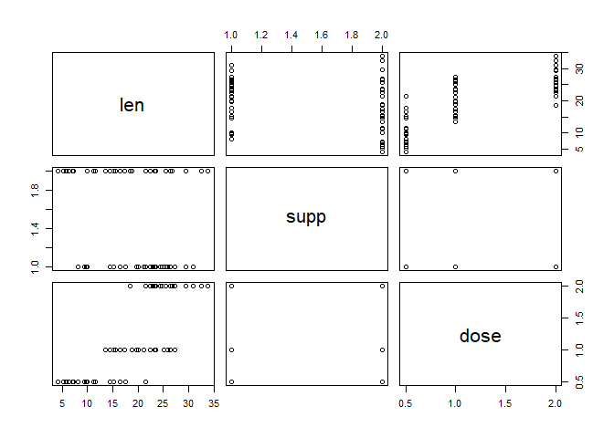
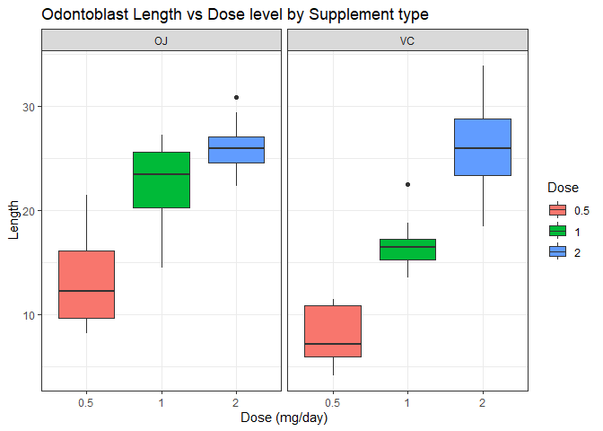

# Synopsis

Based on the `ToothGrowth` data from the R `datasets` package, we analyze
the effect of vitamin C on the length of odontoblasts in guinea pigs. We want 
to study whether the amount of vitamin C or the method it is delivered to 
guinea pigs affect the length of the odontoblasts. We conjecture that they do.

# Data 

The dataset contains the length of odontoblasts (cells responsible for tooth
growth) in 60 guinea pigs that received different doses of vitamin C by 
different methods. Each animal received one of three dose levels of
vitamin C (0.5, 1, and 2 mg/day) by one of two delivery methods, orange juice 
or ascorbic acid (a form of vitamin C and coded as VC).


```r
set.seed(0);
data("ToothGrowth");
```

### Packages

The following packages will be used to perform the analysis.


```r
library(dplyr);
library(ggplot2);
```

# Exploratory analysis

We start by having a look at the size of our data set: 
dim = 60 x 3.
Hence we have, as expected, 3 observations for 
60 subjects. Let us have a look at the head, the tail and the structure of our data


```
##    len supp dose
## 1  4.2   VC  0.5
## 2 11.5   VC  0.5
## 3  7.3   VC  0.5
## 4  5.8   VC  0.5
## 5  6.4   VC  0.5
## 6 10.0   VC  0.5
```

```
##     len supp dose
## 55 24.8   OJ    2
## 56 30.9   OJ    2
## 57 26.4   OJ    2
## 58 27.3   OJ    2
## 59 29.4   OJ    2
## 60 23.0   OJ    2
```

```
## 'data.frame':	60 obs. of  3 variables:
##  $ len : num  4.2 11.5 7.3 5.8 6.4 10 11.2 11.2 5.2 7 ...
##  $ supp: Factor w/ 2 levels "OJ","VC": 2 2 2 2 2 2 2 2 2 2 ...
##  $ dose: num  0.5 0.5 0.5 0.5 0.5 0.5 0.5 0.5 0.5 0.5 ...
```

respectively. The dataset is already clean and we may provide a basic summary of the data:


```
##       len        supp         dose      
##  Min.   : 4.20   OJ:30   Min.   :0.500  
##  1st Qu.:13.07   VC:30   1st Qu.:0.500  
##  Median :19.25           Median :1.000  
##  Mean   :18.81           Mean   :1.167  
##  3rd Qu.:25.27           3rd Qu.:2.000  
##  Max.   :33.90           Max.   :2.000
```

By keeping in mind our working questions, we can also have a quick look at 
potential correlations:



Apparently, the dose level has a clear effect, while we cannot draw conclusions
about the delivery method, yet. The following additional boxplot, grouped by 
delivery method, confirms the effect of dosage and suggest a possible effect 
of delivery method at dose level 0.5 and 1:



# Hypothesis tests

In view of the relative small size of samples and under the reasonable 
hypothesis that the underlying data are iid Gaussian, we are going to perform 
two group T tests for equality of means. However, it is important to consider the 
multiple hypothesis testing issue here as we are going to perform 5
tests. We will implicitly apply the Bonferroni correction, so for a level 
\(\alpha = 0.05\) we will consider significant the p-values under \(0.01\).

### Compare tooth growth by dose level

Our first hypothesis is that a higher dose level of vitamin C leads to a 
higher length of odontoblasts. To support this hypothesis we compare level 
1 with level 0.5 and level 2 with level 1, the null hypothesis always being 
that there is no significant difference in the means and the alternative
being that a higher level of vitamin C entails a longer length of odontoblasts.

First we split the three groups according to the rule 

- group 1: dose level = 0.5 mg/day,
- group 2: dose level = 1 mg/day,
- group 3: dose level = 2 mg/day

and we compute their sample means:


```
##   grp1   grp2   grp3 
## 10.605 19.735 26.100
```

Then we perform a T test to check whether there is a significant difference 
between the means at level \(\alpha = 0.05\). For the sake of space, 
we only report the p-value. The full output of the test can be found in the 
appendices. If we compare group 2 (dose level = 1 mg/day) with group 1 
(dose level = 0.5 mg/day):


```r
t.test(grp2, grp1, alternative = "greater")$p.value
```

```
## [1] 6.341504e-08
```

We can reject the null hypothesis that the two means coincide, since the 
p-value is much smaller than 0.01. Similarly, if we compare group 3 (dose 
level = 2 mg/day) with group 2 (dose level = 1 mg/day):


```r
t.test(grp3, grp2, alternative = "greater")$p.value
```

```
## [1] 9.532148e-06
```

then we can reject the null hypothesis of equal means, since the p-value is much 
smaller than 0.01. There is no need, in this case, to test group 3 versus 
group 1.

Therefore, we conclude that a higher level of vitamin C is related with a 
longer length of the odontoblasts at level 0.05.

For the sake of clarity, we can also compute two-sided 99% T confidence 
intervals for the means using the `conf.int` component of `t.test`:


```
##              min      max
## grp1mn  7.726392 13.48361
## grp2mn 16.910337 22.55966
## grp3mn 23.685584 28.51442
```

Comparing the computed means above with the confidence intervals 
we computed, we can confirm that we may safely reject the null hypotheses at 
level 0.05.

### Compare tooth growth by delivery method

Our second hypothesis is that also the delivery method affects 
tooth growth. Namely, we suspect that subjects that received vitamin C at dose 
levels 0.5 and 1 mg/day through orange juice have longer odontoblasts. Instead, 
we believe that the supply method has no significant effect at a dosage of 
2 mg/day.

We separate the three groups by dosage, OJ versus VC, and we 
compute the respective sample means:


```
## OJgrp1 OJgrp2 OJgrp3 VCgrp1 VCgrp2 VCgrp3 
##  13.23  22.70  26.06   7.98   7.98  26.14
```

Then we perform a T test to check whether there is a significant difference 
between the means at level \(\alpha = 0.05\). If we compare the OJ group with the VC group:


```r
t.test(suppOJgrp1,suppVCgrp1,alternative = "greater")$p.value
```

```
## [1] 0.003179303
```

```r
t.test(suppOJgrp2,suppVCgrp2,alternative = "greater")$p.value
```

```
## [1] 0.0005191879
```

then we can reject the hypothesis of equal means at level 0.05 for 
the 0.5 and the 1 mg/day dose levels, while


```r
t.test(suppOJgrp3,suppVCgrp3,alternative = "greater")$p.value
```

```
## [1] 0.5180742
```

so we cannot reject the null hypothesis of equal means for the highest dosage.

We conclude that there is a relationship between the delivery method and 
the length of the odontoblasts at lower dosage (0.5 or 1 mg/day): subjects that 
received vitamin C via orange juice have, on average, longer odontoblasts than 
those who received it via ascorbic acid.

# Appendices

## Full outcomes of the T tests to check the effect of dosage.

### Group 2 (dose level = 1 mg/day) vs group 1 (dose level = 0.5 mg/day):


```r
t.test(grp2, grp1, alternative = "greater")
```

```
## 
## 	Welch Two Sample t-test
## 
## data:  grp2 and grp1
## t = 6.4766, df = 37.986, p-value = 6.342e-08
## alternative hypothesis: true difference in means is greater than 0
## 95 percent confidence interval:
##  6.753323      Inf
## sample estimates:
## mean of x mean of y 
##    19.735    10.605
```

### Group 3 (dose level = 2 mg/day) vs group 2 (dose level = 1 mg/day):


```r
t.test(grp3, grp2, alternative = "greater")
```

```
## 
## 	Welch Two Sample t-test
## 
## data:  grp3 and grp2
## t = 4.9005, df = 37.101, p-value = 9.532e-06
## alternative hypothesis: true difference in means is greater than 0
## 95 percent confidence interval:
##  4.17387     Inf
## sample estimates:
## mean of x mean of y 
##    26.100    19.735
```

## Full outcomes of the T tests to check the effect of delivery method by dosage

### Orange juice vs ascorbic acid at dosage 0.5


```r
t.test(suppOJgrp1,suppVCgrp1,alternative = "greater")
```

```
## 
## 	Welch Two Sample t-test
## 
## data:  suppOJgrp1 and suppVCgrp1
## t = 3.1697, df = 14.969, p-value = 0.003179
## alternative hypothesis: true difference in means is greater than 0
## 95 percent confidence interval:
##  2.34604     Inf
## sample estimates:
## mean of x mean of y 
##     13.23      7.98
```

### Orange juice vs ascorbic acid at dosage 1


```r
t.test(suppOJgrp2,suppVCgrp2,alternative = "greater")
```

```
## 
## 	Welch Two Sample t-test
## 
## data:  suppOJgrp2 and suppVCgrp2
## t = 4.0328, df = 15.358, p-value = 0.0005192
## alternative hypothesis: true difference in means is greater than 0
## 95 percent confidence interval:
##  3.356158      Inf
## sample estimates:
## mean of x mean of y 
##     22.70     16.77
```

### Orange juice vs ascorbic acid at dosage 2


```r
t.test(suppOJgrp3,suppVCgrp3,alternative = "greater")
```

```
## 
## 	Welch Two Sample t-test
## 
## data:  suppOJgrp3 and suppVCgrp3
## t = -0.046136, df = 14.04, p-value = 0.5181
## alternative hypothesis: true difference in means is greater than 0
## 95 percent confidence interval:
##  -3.1335     Inf
## sample estimates:
## mean of x mean of y 
##     26.06     26.14
```
