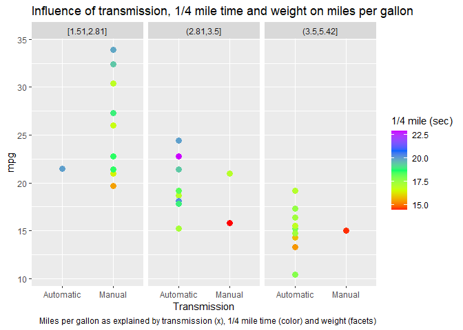

# Executive summary

We examine the effect of the transmission type (manual vs automatic) on the 
miles per gallon (mpg) in the mtcars dataset using linear regression. In
particular, we focus on the following questions:

* Is an automatic or manual transmission better for mpg?
* Can we quantify the mpg difference between automatic and manual transmissions?

Regression analysis using transmission type, weight, and quarter mile time as
explanatory variables leads to the conclusion that manual cars get on average 
14 more mpg than automatic cars, holding the other effects constant.

### Packages

We will use the `dplyr` package for working with data frames and the `ggplot2`
package for graphs.


```r
library(dplyr)
library(ggplot2)
```

# Data

The data set comes from the 1974 Motor Trend US magazine, and comprises 
fuel consumption and 10 aspects of automobile design and performance for 32 
automobiles (1973–74 models).


```r
library(datasets)
data("mtcars")
```

# Exploratory data analysis

We are dealing with a 
32 x 11 
data set: we have 11 observations for 
32 cars. Let us have a look at the data (we refer the reader 
to the `mtcars` help page for the explanation of the variable names).


```r
str(mtcars)
```

```
## 'data.frame':	32 obs. of  11 variables:
##  $ mpg : num  21 21 22.8 21.4 18.7 18.1 14.3 24.4 22.8 19.2 ...
##  $ cyl : num  6 6 4 6 8 6 8 4 4 6 ...
##  $ disp: num  160 160 108 258 360 ...
##  $ hp  : num  110 110 93 110 175 105 245 62 95 123 ...
##  $ drat: num  3.9 3.9 3.85 3.08 3.15 2.76 3.21 3.69 3.92 3.92 ...
##  $ wt  : num  2.62 2.88 2.32 3.21 3.44 ...
##  $ qsec: num  16.5 17 18.6 19.4 17 ...
##  $ vs  : num  0 0 1 1 0 1 0 1 1 1 ...
##  $ am  : num  1 1 1 0 0 0 0 0 0 0 ...
##  $ gear: num  4 4 4 3 3 3 3 4 4 4 ...
##  $ carb: num  4 4 1 1 2 1 4 2 2 4 ...
```

```r
tail(mtcars)
```

```
##                 mpg cyl  disp  hp drat    wt qsec vs am gear carb
## Porsche 914-2  26.0   4 120.3  91 4.43 2.140 16.7  0  1    5    2
## Lotus Europa   30.4   4  95.1 113 3.77 1.513 16.9  1  1    5    2
## Ford Pantera L 15.8   8 351.0 264 4.22 3.170 14.5  0  1    5    4
## Ferrari Dino   19.7   6 145.0 175 3.62 2.770 15.5  0  1    5    6
## Maserati Bora  15.0   8 301.0 335 3.54 3.570 14.6  0  1    5    8
## Volvo 142E     21.4   4 121.0 109 4.11 2.780 18.6  1  1    4    2
```

```r
summary(mtcars)
```

```
##       mpg             cyl             disp             hp       
##  Min.   :10.40   Min.   :4.000   Min.   : 71.1   Min.   : 52.0  
##  1st Qu.:15.43   1st Qu.:4.000   1st Qu.:120.8   1st Qu.: 96.5  
##  Median :19.20   Median :6.000   Median :196.3   Median :123.0  
##  Mean   :20.09   Mean   :6.188   Mean   :230.7   Mean   :146.7  
##  3rd Qu.:22.80   3rd Qu.:8.000   3rd Qu.:326.0   3rd Qu.:180.0  
##  Max.   :33.90   Max.   :8.000   Max.   :472.0   Max.   :335.0  
##       drat             wt             qsec             vs        
##  Min.   :2.760   Min.   :1.513   Min.   :14.50   Min.   :0.0000  
##  1st Qu.:3.080   1st Qu.:2.581   1st Qu.:16.89   1st Qu.:0.0000  
##  Median :3.695   Median :3.325   Median :17.71   Median :0.0000  
##  Mean   :3.597   Mean   :3.217   Mean   :17.85   Mean   :0.4375  
##  3rd Qu.:3.920   3rd Qu.:3.610   3rd Qu.:18.90   3rd Qu.:1.0000  
##  Max.   :4.930   Max.   :5.424   Max.   :22.90   Max.   :1.0000  
##        am              gear            carb      
##  Min.   :0.0000   Min.   :3.000   Min.   :1.000  
##  1st Qu.:0.0000   1st Qu.:3.000   1st Qu.:2.000  
##  Median :0.0000   Median :4.000   Median :2.000  
##  Mean   :0.4062   Mean   :3.688   Mean   :2.812  
##  3rd Qu.:1.0000   3rd Qu.:4.000   3rd Qu.:4.000  
##  Max.   :1.0000   Max.   :5.000   Max.   :8.000
```

To begin with, it is useful to look at a plot of how the different mpg
measures (25th, 50th, and 75th percentile of mpg) vary across the two
categories.

<div class="figure" style="text-align: center">

<p class="caption">(\#fig:boxplot)Box plot</p>
</div>

It seems that manual transmission is better for mpg : cars with manual
transmission covers more miles per gallon. To quantify this effect we perform a
linear regression with `mpg` as outcome and the factor variable `am` as 
predictor, without intercept (which is the same as a T-test)


```r
naive_fit <- lm(mpg ~ as.factor(am)-1, data = mtcars)
```

|  | mean | std error | 95% conf int |
| :---: | :---: | :---: | :---: |
| automatic | 17.1474 | 1.1246 | [14.8506, 19.4441]
| manual | 24.3923 | 1.3596 | [21.6157, 27.1689] |

However, we reasonably expect that other factors play a role. For example:

<div class="figure" style="text-align: center">

<p class="caption">(\#fig:pairs)Pair plot</p>
</div>

As we can see, `mpg` is also influenced by `cyl`, `hp`, `wt`, `qsec`, 
and not all of them are uncorrelated.

# Model selection

It may happen that the effect of transmission on miles per gallon is biased by 
the fact that we are not considering other factors. Therefore we start nesting 
models in order to see if adding regressors have a significant effect above and
beyond the change in degrees of freedom.


```r
data <- mtcars %>%
        mutate(
                cyl = as.factor(cyl),
                vs = as.factor(vs),
                am = as.factor(am),
                gear = as.factor(gear),
                carb = as.factor(carb)
        )
```

Since it is clear that the weight of the car influences its miles per gallon, 
we start adding `wt` to our model and then we ask whether adding another 
variable has a significant effect, by relying on the ANOVA test.


```r
seek <- function(var, params = c()) {
        formula <- reformulate(c(params, var), response = 'mpg')
        fit_new <- lm(formula, data)
        cat("p-value for adding", var, "is", anova(fit, fit_new)[2,6], "\n")
}

fit <- lm(mpg ~ am + wt, data)
invisible(sapply(names(select(data, !c(mpg,am,wt))), seek, params = c('am','wt')))
```

```
## p-value for adding cyl is 0.003473216 
## p-value for adding disp is 0.0678774 
## p-value for adding hp is 0.0005464023 
## p-value for adding drat is 0.2849371 
## p-value for adding qsec is 0.0002161737 
## p-value for adding vs is 0.008454158 
## p-value for adding gear is 0.1200295 
## p-value for adding carb is 0.2470563
```

A posteriori, we will perform 20 tests. Therefore, to take into account the multiple hypothesis testing issue and to control the false positive
rate at level \(\alpha = 0.05\), we call significant the p-values below 
\(0.05/20 = 0.0025\). It turns out that `hp` and `qsec` have a 
significant effect. Since `qsec` is the one with weaker correlation with `wt`: 


```
##     qsec   hp
## wt -0.17 0.66
```

then we add `qsec` to our model and we ask ourselves the same question.


```r
fit <- lm(mpg ~ am + wt + qsec, data)
invisible(sapply(names(select(data, !c(mpg,am,wt,qsec))), seek, params = c('am','wt','qsec') ))
```

```
## p-value for adding cyl is 0.4582894 
## p-value for adding disp is 0.4717085 
## p-value for adding hp is 0.2230879 
## p-value for adding drat is 0.6390028 
## p-value for adding vs is 0.9931865 
## p-value for adding gear is 0.9858944 
## p-value for adding carb is 0.8960083
```

We conclude that no other variable has a significant effect, so we search for potential cross-effects:

| ANOVA w.r.t. adding | `am:wt` | `am:qsec` | `wt:qsec` |
| :---: | :---: | :---: | :---: |
| p-value | 0.0018086 | 0.0384079 | 0.2823973 |

We can fit our linear model with `mpg` as output and `am`, `wt`, `am:wt`, `qsec` as regressors and view the inference results:


```r
fit <- lm(mpg ~ am*wt + qsec, data)
summary(fit)
```

```
## 
## Call:
## lm(formula = mpg ~ am * wt + qsec, data = data)
## 
## Residuals:
##     Min      1Q  Median      3Q     Max 
## -3.5076 -1.3801 -0.5588  1.0630  4.3684 
## 
## Coefficients:
##             Estimate Std. Error t value Pr(>|t|)    
## (Intercept)    9.723      5.899   1.648 0.110893    
## am1           14.079      3.435   4.099 0.000341 ***
## wt            -2.937      0.666  -4.409 0.000149 ***
## qsec           1.017      0.252   4.035 0.000403 ***
## am1:wt        -4.141      1.197  -3.460 0.001809 ** 
## ---
## Signif. codes:  0 '***' 0.001 '**' 0.01 '*' 0.05 '.' 0.1 ' ' 1
## 
## Residual standard error: 2.084 on 27 degrees of freedom
## Multiple R-squared:  0.8959,	Adjusted R-squared:  0.8804 
## F-statistic: 58.06 on 4 and 27 DF,  p-value: 7.168e-13
```

Therefore, holding constant quarter mile time and weight, cars with manual
transmissions get about 14 more miles per gallon:

|  | estimate | std error | 95% conf int |
| :---: | :---: | :---: | :---: |
| manual | 14.0794 | 3.4353 | [7.0309, 21.128] |

Moreover, we are satisfied because our model significantly explains about 90% of the variance (R-squared is 0.8959).

We can check if regression assumptions are met, namely the normality assumption for the residuals, with a Shapiro-Wilk test and diagnostic plotting:


```r
shapiro.test(fit$residuals)
```

```
## 
## 	Shapiro-Wilk normality test
## 
## data:  fit$residuals
## W = 0.94444, p-value = 0.1001
```

<div class="figure" style="text-align: center">

<p class="caption">(\#fig:diagPlot)Diagnostic plotting</p>
</div>

Normality assumptions don’t seem far off (approximately), and heteroskedasticity doesn’t seem to be an issue.

# Conclusions

Regression analysis using transmission type, weight, and quarter mile time as
explanatory variables leads to the conclusion that manual cars get on average 
14.08 \(\pm\) 3.44
more mpg than automatic cars, holding the other effects constant.

However, the number of observations is relatively small, whence it is difficult
to draw trustful conclusions. Figure \@ref(fig:scatterplot) offers a glimpse of 
the problem. It is advisable to obtain a new and larger data 
set to challenge these results.

# Appendices

<div class="figure" style="text-align: center">

<p class="caption">(\#fig:scatterplot)4-dim scatterplot</p>
</div>
