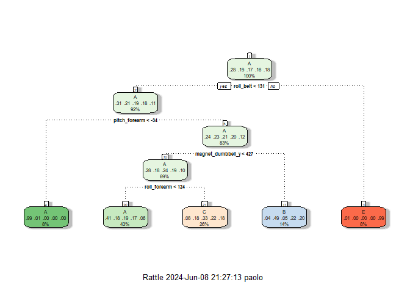
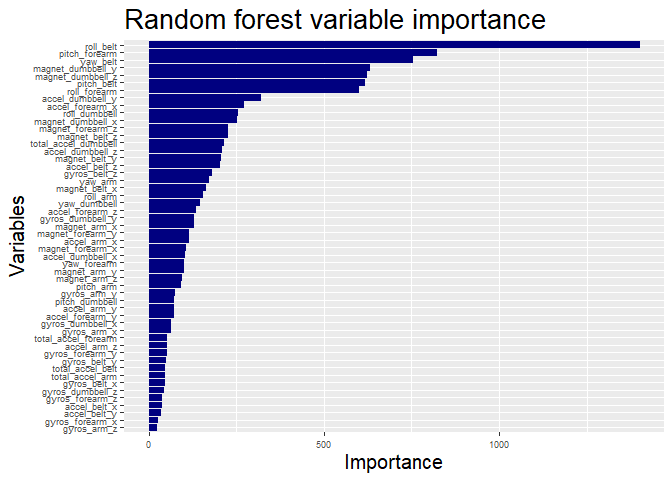

# Summary

We analyze the Weight Lifting Exercises Dataset, which gathers data from accelerometers on the belt, forearm, arm, and dumbell of 6 people performing barbell lifts correctly and incorrectly in 5 different ways. After fitting a predictive model for activity recognition based on these data, we use it to predict the correctness of the exercises performed by new users.

## Packages

We will use the `dplyr` package for working with data frames, the `ggplot2`
package for graphs, the `caret` package for training and predicting.


```r
library(dplyr); library(ggplot2); library(caret); set.seed(0)
```

## Background

Using devices such as Jawbone Up, Nike FuelBand, and Fitbit it is now possible to collect a large amount of data about personal activity relatively inexpensively. These type of devices are part of the quantified self movement - a group of enthusiasts who take measurements about themselves regularly to improve their health, to find patterns in their behavior, or because they are tech geeks. One thing that people regularly do is quantify how much of a particular activity they do, but they rarely quantify how well they do it. In this project, your goal will be to use data from accelerometers on the belt, forearm, arm, and dumbell of 6 participants. They were asked to perform barbell lifts correctly and incorrectly in 5 different ways. More information is available from [webpage of the project](http://groupware.les.inf.puc-rio.br/har) (see the section on the Weight Lifting Exercise Dataset).

# Data

The data set originally comes from the Weight Lifting Exercises Dataset (see the section on the Weight Lifting Exercise Dataset on the [webpage of the project](http://groupware.les.inf.puc-rio.br/har) - possibly see the web archive version of it at [web.archive.org/web/20161224072740/http:/groupware.les.inf.puc-rio.br/har](http://web.archive.org/web/20161224072740/http:/groupware.les.inf.puc-rio.br/har)).
The training data for this project are also available at: 

[https://d396qusza40orc.cloudfront.net/predmachlearn/pml-training.csv](https://d396qusza40orc.cloudfront.net/predmachlearn/pml-training.csv)

The test data are also available at:

[https://d396qusza40orc.cloudfront.net/predmachlearn/pml-testing.csv](https://d396qusza40orc.cloudfront.net/predmachlearn/pml-testing.csv)

We downloaded the data into a `data` folder as `train.csv` and `test.csv`.


```r
raw_training <- read.csv("data/train.csv")
raw_testing <- read.csv("data/test.csv")
```

## Exploratory data analysis

We are dealing with a 
19622 x 160 
training data set and a 20 x 160 test data set. Let us inspect the training data and leave aside the test data set. Details are suppressed for the sake of brevity, but we explicitly show the names of the variables in the data set for the convenience of the reader.


```r
head(raw_training)
tail(raw_training)
str(raw_training)
summary(raw_training)
```

```r
names(raw_training)
```

```
##   [1] "X"                        "user_name"               
##   [3] "raw_timestamp_part_1"     "raw_timestamp_part_2"    
##   [5] "cvtd_timestamp"           "new_window"              
##   [7] "num_window"               "roll_belt"               
##   [9] "pitch_belt"               "yaw_belt"                
##  [11] "total_accel_belt"         "kurtosis_roll_belt"      
##  [13] "kurtosis_picth_belt"      "kurtosis_yaw_belt"       
##  [15] "skewness_roll_belt"       "skewness_roll_belt.1"    
##  [17] "skewness_yaw_belt"        "max_roll_belt"           
##  [19] "max_picth_belt"           "max_yaw_belt"            
##  [21] "min_roll_belt"            "min_pitch_belt"          
##  [23] "min_yaw_belt"             "amplitude_roll_belt"     
##  [25] "amplitude_pitch_belt"     "amplitude_yaw_belt"      
##  [27] "var_total_accel_belt"     "avg_roll_belt"           
##  [29] "stddev_roll_belt"         "var_roll_belt"           
##  [31] "avg_pitch_belt"           "stddev_pitch_belt"       
##  [33] "var_pitch_belt"           "avg_yaw_belt"            
##  [35] "stddev_yaw_belt"          "var_yaw_belt"            
##  [37] "gyros_belt_x"             "gyros_belt_y"            
##  [39] "gyros_belt_z"             "accel_belt_x"            
##  [41] "accel_belt_y"             "accel_belt_z"            
##  [43] "magnet_belt_x"            "magnet_belt_y"           
##  [45] "magnet_belt_z"            "roll_arm"                
##  [47] "pitch_arm"                "yaw_arm"                 
##  [49] "total_accel_arm"          "var_accel_arm"           
##  [51] "avg_roll_arm"             "stddev_roll_arm"         
##  [53] "var_roll_arm"             "avg_pitch_arm"           
##  [55] "stddev_pitch_arm"         "var_pitch_arm"           
##  [57] "avg_yaw_arm"              "stddev_yaw_arm"          
##  [59] "var_yaw_arm"              "gyros_arm_x"             
##  [61] "gyros_arm_y"              "gyros_arm_z"             
##  [63] "accel_arm_x"              "accel_arm_y"             
##  [65] "accel_arm_z"              "magnet_arm_x"            
##  [67] "magnet_arm_y"             "magnet_arm_z"            
##  [69] "kurtosis_roll_arm"        "kurtosis_picth_arm"      
##  [71] "kurtosis_yaw_arm"         "skewness_roll_arm"       
##  [73] "skewness_pitch_arm"       "skewness_yaw_arm"        
##  [75] "max_roll_arm"             "max_picth_arm"           
##  [77] "max_yaw_arm"              "min_roll_arm"            
##  [79] "min_pitch_arm"            "min_yaw_arm"             
##  [81] "amplitude_roll_arm"       "amplitude_pitch_arm"     
##  [83] "amplitude_yaw_arm"        "roll_dumbbell"           
##  [85] "pitch_dumbbell"           "yaw_dumbbell"            
##  [87] "kurtosis_roll_dumbbell"   "kurtosis_picth_dumbbell" 
##  [89] "kurtosis_yaw_dumbbell"    "skewness_roll_dumbbell"  
##  [91] "skewness_pitch_dumbbell"  "skewness_yaw_dumbbell"   
##  [93] "max_roll_dumbbell"        "max_picth_dumbbell"      
##  [95] "max_yaw_dumbbell"         "min_roll_dumbbell"       
##  [97] "min_pitch_dumbbell"       "min_yaw_dumbbell"        
##  [99] "amplitude_roll_dumbbell"  "amplitude_pitch_dumbbell"
## [101] "amplitude_yaw_dumbbell"   "total_accel_dumbbell"    
## [103] "var_accel_dumbbell"       "avg_roll_dumbbell"       
## [105] "stddev_roll_dumbbell"     "var_roll_dumbbell"       
## [107] "avg_pitch_dumbbell"       "stddev_pitch_dumbbell"   
## [109] "var_pitch_dumbbell"       "avg_yaw_dumbbell"        
## [111] "stddev_yaw_dumbbell"      "var_yaw_dumbbell"        
## [113] "gyros_dumbbell_x"         "gyros_dumbbell_y"        
## [115] "gyros_dumbbell_z"         "accel_dumbbell_x"        
## [117] "accel_dumbbell_y"         "accel_dumbbell_z"        
## [119] "magnet_dumbbell_x"        "magnet_dumbbell_y"       
## [121] "magnet_dumbbell_z"        "roll_forearm"            
## [123] "pitch_forearm"            "yaw_forearm"             
## [125] "kurtosis_roll_forearm"    "kurtosis_picth_forearm"  
## [127] "kurtosis_yaw_forearm"     "skewness_roll_forearm"   
## [129] "skewness_pitch_forearm"   "skewness_yaw_forearm"    
## [131] "max_roll_forearm"         "max_picth_forearm"       
## [133] "max_yaw_forearm"          "min_roll_forearm"        
## [135] "min_pitch_forearm"        "min_yaw_forearm"         
## [137] "amplitude_roll_forearm"   "amplitude_pitch_forearm" 
## [139] "amplitude_yaw_forearm"    "total_accel_forearm"     
## [141] "var_accel_forearm"        "avg_roll_forearm"        
## [143] "stddev_roll_forearm"      "var_roll_forearm"        
## [145] "avg_pitch_forearm"        "stddev_pitch_forearm"    
## [147] "var_pitch_forearm"        "avg_yaw_forearm"         
## [149] "stddev_yaw_forearm"       "var_yaw_forearm"         
## [151] "gyros_forearm_x"          "gyros_forearm_y"         
## [153] "gyros_forearm_z"          "accel_forearm_x"         
## [155] "accel_forearm_y"          "accel_forearm_z"         
## [157] "magnet_forearm_x"         "magnet_forearm_y"        
## [159] "magnet_forearm_z"         "classe"
```

## Data preprocessing

The first 7 columns contain data that are not useful for our purposes, hence we drop them. We also convert to numeric those columns that are erroneously interpreted as integers or characters. Then we drop those columns that are mostly (at least 90%) NAs. Finally, we check whether there are columns with almost zero variance, but there are not and we consider ourselves satisfied.


```r
training <- raw_training %>%
        select(!c(X, user_name,
                  raw_timestamp_part_1,
                  raw_timestamp_part_2,
                  cvtd_timestamp,
                  new_window,
                  num_window)) %>%
        mutate(across(!classe, as.numeric), 
               classe = factor(classe)) %>%
        select(where(function(X) { mean(is.na(X)) < 0.9 }))
nzv <- nearZeroVar(training)
nzv
```

```
## integer(0)
```

```r
# training <- select(training, !all_of(nzv))
dim(training)
```

```
## [1] 19622    53
```

# Model selection

In order to select a model, we compare the accuracy of three models seen in the course: **decision tree**, **random forest** and **gradient-boosting trees** model.

## Holdout Cross Validation

We split our training data set into a data set for training the algorithms (`70%` of the data) and a data set for validating the results and compare their accuracy (`30%` of the data).


```r
inTrain <- createDataPartition(y = training$classe,
                               p = 0.7,
                               list = FALSE)
trainSet <- training[inTrain,]
validationSet <- training[-inTrain,]
```

We also decide to perform **3-fold cross validation** in the training phase, to reduce the bias and improve the prediction capability of our models.


```r
control <- trainControl(method = "cv", number = 3)
```

### Decision tree

We start by training a single decision tree.

#### Creating the model

Train the decision tree


```r
Tree <- train(classe ~ ., data = trainSet,
              method = "rpart", trControl = control)
rattle::fancyRpartPlot(Tree$finalModel)
```

<!-- -->

#### Estimation of the in sample accuracy/error

Estimate accuracy on the training data


```r
confusionMatrix(predict(Tree, trainSet), trainSet$classe)$overall
```

```
##       Accuracy          Kappa  AccuracyLower  AccuracyUpper   AccuracyNull 
##      0.4973429      0.3438398      0.4889467      0.5057403      0.2843416 
## AccuracyPValue  McnemarPValue 
##      0.0000000            NaN
```

#### Check performance on validation data

Predict on the validation data set and check out-of-sample performance


```r
predTree <- predict(Tree, validationSet)
CnfMtxTree <- confusionMatrix(predTree, validationSet$classe)
CnfMtxTree
```

```
## Confusion Matrix and Statistics
## 
##           Reference
## Prediction    A    B    C    D    E
##          A 1519  484  475  422  171
##          B   42  394   32  184  147
##          C  109  261  519  358  278
##          D    0    0    0    0    0
##          E    4    0    0    0  486
## 
## Overall Statistics
##                                          
##                Accuracy : 0.4958         
##                  95% CI : (0.483, 0.5087)
##     No Information Rate : 0.2845         
##     P-Value [Acc > NIR] : < 2.2e-16      
##                                          
##                   Kappa : 0.3408         
##                                          
##  Mcnemar's Test P-Value : NA             
## 
## Statistics by Class:
## 
##                      Class: A Class: B Class: C Class: D Class: E
## Sensitivity            0.9074  0.34592  0.50585   0.0000  0.44917
## Specificity            0.6314  0.91466  0.79296   1.0000  0.99917
## Pos Pred Value         0.4946  0.49312  0.34033      NaN  0.99184
## Neg Pred Value         0.9449  0.85352  0.88372   0.8362  0.88953
## Prevalence             0.2845  0.19354  0.17434   0.1638  0.18386
## Detection Rate         0.2581  0.06695  0.08819   0.0000  0.08258
## Detection Prevalence   0.5218  0.13577  0.25913   0.0000  0.08326
## Balanced Accuracy      0.7694  0.63029  0.64940   0.5000  0.72417
```

We conclude that this single decision tree has an accuracy of 0.4958369

### Random forest

As second option, we train a random forest.

#### Creating the model

Train the random forest


```r
Forest <- train(classe ~ ., data = trainSet,
               method = "rf", trControl = control)
```

#### Estimation of the in sample accuracy/error

Estimate accuracy on the training data


```r
confusionMatrix(predict(Forest, trainSet), trainSet$classe)$overall
```

```
##       Accuracy          Kappa  AccuracyLower  AccuracyUpper   AccuracyNull 
##      0.9985441      0.9981584      0.9977523      0.9991105      0.2843416 
## AccuracyPValue  McnemarPValue 
##      0.0000000            NaN
```

#### Check performance on validation data

Predict on the validation data set and check out-of-sample performance


```r
predRF <- predict(Forest, validationSet)
CnfMtxRF <- confusionMatrix(predRF, validationSet$classe)
CnfMtxRF
```

```
## Confusion Matrix and Statistics
## 
##           Reference
## Prediction    A    B    C    D    E
##          A 1674    2    0    0    0
##          B    0 1134    3    0    0
##          C    0    3 1023    2    0
##          D    0    0    0  961    0
##          E    0    0    0    1 1082
## 
## Overall Statistics
##                                           
##                Accuracy : 0.9981          
##                  95% CI : (0.9967, 0.9991)
##     No Information Rate : 0.2845          
##     P-Value [Acc > NIR] : < 2.2e-16       
##                                           
##                   Kappa : 0.9976          
##                                           
##  Mcnemar's Test P-Value : NA              
## 
## Statistics by Class:
## 
##                      Class: A Class: B Class: C Class: D Class: E
## Sensitivity            1.0000   0.9956   0.9971   0.9969   1.0000
## Specificity            0.9995   0.9994   0.9990   1.0000   0.9998
## Pos Pred Value         0.9988   0.9974   0.9951   1.0000   0.9991
## Neg Pred Value         1.0000   0.9989   0.9994   0.9994   1.0000
## Prevalence             0.2845   0.1935   0.1743   0.1638   0.1839
## Detection Rate         0.2845   0.1927   0.1738   0.1633   0.1839
## Detection Prevalence   0.2848   0.1932   0.1747   0.1633   0.1840
## Balanced Accuracy      0.9998   0.9975   0.9980   0.9984   0.9999
```

We conclude that this random forest model has an accuracy of 0.9981308

### Gradient-boosted Trees Model

Finally, we perform gradient boosting with decision trees as base learners.

#### Creating the model

Train the GBM


```r
GradBoostTrees <- train(classe ~ ., data = trainSet, method = "gbm", 
                        verbose = FALSE, trControl = control)
```

#### Estimation of the in sample accuracy/error

Estimate accuracy on the training data


```r
confusionMatrix(predict(GradBoostTrees, trainSet), trainSet$classe)$overall
```

```
##       Accuracy          Kappa  AccuracyLower  AccuracyUpper   AccuracyNull 
##   9.716095e-01   9.640846e-01   9.686939e-01   9.743230e-01   2.843416e-01 
## AccuracyPValue  McnemarPValue 
##   0.000000e+00   2.954127e-14
```

#### Check performance on validation data

Predict on the validation data set and check out-of-sample performance


```r
predGBM <- predict(GradBoostTrees, validationSet)
CnfMtxGBM <- confusionMatrix(predGBM, validationSet$classe)
CnfMtxGBM
```

```
## Confusion Matrix and Statistics
## 
##           Reference
## Prediction    A    B    C    D    E
##          A 1648   31    0    2    3
##          B   14 1080   20    1    7
##          C    9   27  992   24    8
##          D    2    1   13  933   10
##          E    1    0    1    4 1054
## 
## Overall Statistics
##                                          
##                Accuracy : 0.9698         
##                  95% CI : (0.9651, 0.974)
##     No Information Rate : 0.2845         
##     P-Value [Acc > NIR] : < 2.2e-16      
##                                          
##                   Kappa : 0.9617         
##                                          
##  Mcnemar's Test P-Value : 9.289e-05      
## 
## Statistics by Class:
## 
##                      Class: A Class: B Class: C Class: D Class: E
## Sensitivity            0.9845   0.9482   0.9669   0.9678   0.9741
## Specificity            0.9915   0.9912   0.9860   0.9947   0.9988
## Pos Pred Value         0.9786   0.9626   0.9358   0.9729   0.9943
## Neg Pred Value         0.9938   0.9876   0.9930   0.9937   0.9942
## Prevalence             0.2845   0.1935   0.1743   0.1638   0.1839
## Detection Rate         0.2800   0.1835   0.1686   0.1585   0.1791
## Detection Prevalence   0.2862   0.1907   0.1801   0.1630   0.1801
## Balanced Accuracy      0.9880   0.9697   0.9764   0.9813   0.9864
```

We conclude that this gradient-boosted trees model has an accuracy of 0.9697536

## Upsum and conclusion of the model selection process


| Model | In sample accuracy | In sample error | Out of sample accuracy | Out of sample error | 95% CI OS Acc |
| :---: | :---: | :---: | :---: | :---: | :---: |
| Decision Tree | 0.4973 | 0.5027 | 0.4958 | 0.5042 | [0.483,0.5087]
| Random Forest | 0.9985 | 0.0015 | 0.9981 | 0.0019 | [0.9967,0.9991]
| Gradient-boosted Trees | 0.9716 | 0.0284 | 0.9698 | 0.0302 | [0.9651,0.974]

Therefore we decide to select the random forest model, since it performed pretty well on the testing data having a 99.81% out-of-sample accuracy rate.

## Check variable importance

Since we opted for the random forest model, we can extract the variable importance from it. This tells us how the variables helped the model in predicting the class of the data. Higher importance means that the variable is useful to the model.


```r
var_imp <- varImp(Forest, scale = F)$importance
var_imp <- data.frame(variables = row.names(var_imp), 
                      importance = var_imp$Overall)
ggplot(aes(x = reorder(variables, importance), y = importance),
       data = var_imp) + geom_bar(stat = 'identity', fill = 'navy') + 
        coord_flip() + labs(x = 'Variables', 
                            y = 'Importance',
                            title='Random forest variable importance') +
        theme(axis.text = element_text(size = 7),
              axis.title = element_text(size = 15),
              plot.title = element_text(size = 20))
```

<!-- -->

# Prediction on test set

We may finally apply our model on testing data.


```r
testing <- raw_testing %>%
        select(names(training[,-53]))
dim(testing)
```

```
## [1] 20 52
```

```r
TestRF <- predict(Forest, testing)
TestRF
```

```
##  [1] B A B A A E D B A A B C B A E E A B B B
## Levels: A B C D E
```
